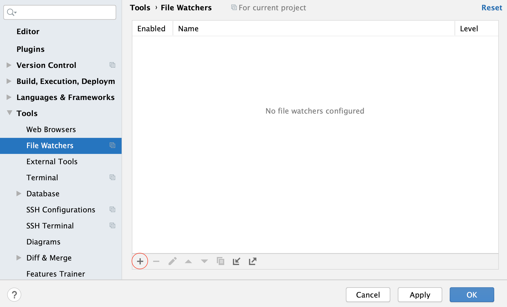
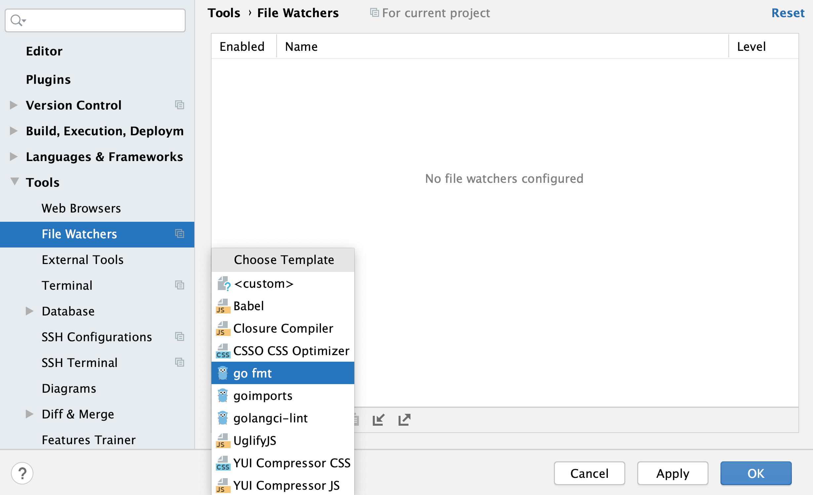
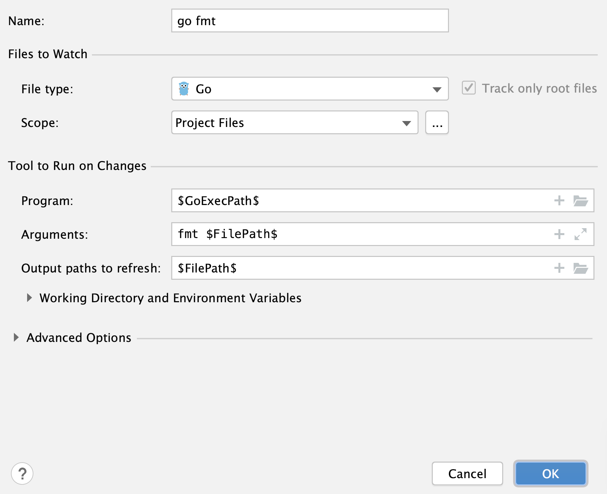

# Домашнее задание к занятию «1.1. Основы Go: типы данных, стандартные конструкции»

В качестве результата пришлите ссылки на ваши GitHub-проекты в личном кабинете студента на сайте [netology.ru](https://netology.ru).

Все задачи этого занятия нужно делать в разных репозиториях (это нужно, чтобы затем удобно их подключать к системам CI и автоматически развёртывать в облаке).

**Важно**: ознакомьтесь со ссылками, представленными на главной странице [репозитория с домашними заданиями](../README.md).

**Важно**: если у вас что-то не получилось, то оформляйте Issue [по установленным правилам](../report-requirements.md).

**Важно**: не делайте ДЗ всех занятий в одном репозитории! Иначе вам потом придётся достаточно сложно подключать системы Continuous Integration.

## Как сдавать задачи

1. Создайте на вашем компьютере Go-модуль (см. доп.видео к первой лекции)
1. Инициализируйте в нём пустой Git-репозиторий
1. Добавьте в него готовый файл [.gitignore](../.gitignore)
1. Добавьте в этот же каталог остальные необходимые файлы
1. Удостоверьтесь, что вы правильно отформатировали файл (см. раздел Форматирование)
1. Сделайте необходимые коммиты
1. Создайте публичный репозиторий на GitHub и свяжите свой локальный репозиторий с удалённым
1. Сделайте пуш (удостоверьтесь, что ваш код появился на GitHub)
1. Ссылку на ваш проект отправьте в личном кабинете на сайте [netology.ru](https://netology.ru)
1. Задачи, отмеченные, как необязательные, можно не сдавать, это не повлияет на получение зачета (в этом ДЗ все задачи являются обязательными)

## Задача №1 - Бонусы

### Легенда

Банк, для которого мы разрабатываем системы, решил внедрить у себя бонусную систему.

В чём суть: пользователю с каждой покупки начисляется бонус в размере 1% от стоимости покупки, но не более 100 бонусов за покупку.

Соответственно, вам нужно написать небольшую программку (прямо в `main`), которая на базе суммы покупки расчитывает сумму бонуса:

```go
func main() {
    purchase := 3333_33
    percent := 1	
    limit := 100
    
    bonus := 0 // вместо нуля ваша формула
    if bonus > limit {
        bonus = limit
    }
    println(bonus) // должно быть 33* (см. объяснение ниже)
}
```

Обратите внимание на конструкцию `if`. В целом, она выглядит так же, как то, что вы проходили на курсах по JS, но (в отличие от JS):
1. Выражение в `if` обязательно должно быть типа `bool` (в JS есть понятие Truthy и Falsy - здесь оно не применимо)
1. Круглые скобки вокруг выражения не нужны
1. Фигурные скобки `{}` обязательны (без них нельзя)

Так же доступны операторы `&&`, `||` и `!`.

Примечание*: тернарного оператора в Go нет.

Вроде простая задача, но на самом деле, не всё так просто 😈:
1. Сумма покупок хранится в копейках (как мы с вами и говорили на лекции)
1. Процент хранится в виде целого числа
1. Бонус начисляется в рублях (при этом любая нецелая часть в копейках откидывается)

<details>
  <summary>Подсказка</summary>
  
  Нехорошо смотреть подсказки 😈!
  
  Но раз уж вы посмотрели, то вот она: внимательно прочитайте слайд из лекции про целые числа. Это позволит вам решить задачу, не прибегая ни к каким преобразованиям типов.
</details>

Итого: у вас должен быть репозиторий на GitHub, в котором расположен ваш Go-модуль с кодом.

## Задача №2 - Миллиардеры

### Легенда

Кто-то "умный" вам сказал, что "нужно экономить память с самого начала". Поэтому вы решили использовать не просто `int`, а `int32` для хранения денег.

Естественно, вы позаботились о том, чтобы деньги хранились в копейках.

И вот незадача, есть у нас клиент-миллионер, у которого на счёте хранится 15 миллионов рублей. И ему пришёл перевод ещё на 10 миллионов.

Т.е. в базовом варианте программа выглядит вот так (у `balance` и `transfer` тип будет `int` и на x64 будет 64-битным):

```go
func main() {
	var balance int32 = 0 // 15 миллионов в копейках
	var transfer int32 = // 10 миллионов в копейках
	total := balance + transfer // int32 + int32 будет int32
    println(total)
}
```

Посмотрите на результат и попробуйте объяснить его. Возможно, в этом вам помогут лекции с Фоксфорд ([лекция про целые числа](https://www.youtube.com/watch?v=g6Y86fAqXEY) и [лекция про вещественные числа](https://www.youtube.com/watch?v=pOZzQqRkuRQ)), в которых рассказано, как числа хранятся в памяти компьютера.

Итого: у вас должен быть репозиторий на GitHub, в котором:
1. Расположен ваш Go-модуль с кодом
1. Pull-Request с описанием проблемы и кодом, её устраняющим

## Форматирование

**Важно: это не ДЗ, сдавать его в виде ДЗ не нужно**.

Вы должны лишь использовать это в каждом ДЗ.

Очень важно правильно форматировать ваш код. В Go, чтобы не порождать войн за стили форматирования, выбрали один единственно верный стиль.

Отформатировать файлы с помощью этого единственно верного стиля можно несколькими способами. Нас будут интересовать два:
1. go fmt через терминал
1. С помощью GoLand

Но до этого, давайте в целом познакомимся с теми инструментами, которые нам предоставляет Go.

### Go Tools

Входной точкой в мир стандартных Go инструментов служит команда `go`.

Если её ввести без аргументов в терминале (вы можете открыть терминал с помощью Alt + F12 в GoLand), то мы получим краткую справку по использованию этой команды:
```shell
$ go

Go is a tool for managing Go source code.

Usage:

        go <command> [arguments]

The commands are:

        bug         start a bug report
        build       compile packages and dependencies
        clean       remove object files and cached files
        doc         show documentation for package or symbol
        env         print Go environment information
        fix         update packages to use new APIs
        fmt         gofmt (reformat) package sources
        generate    generate Go files by processing source
        ...
```

Потратьте своё время, чтобы кратко ознакомиться с тем, какие команды доступны.

Справку по каждой команде можно получить с помощью команды `help`:
```shell
$ go help fmt

usage: go fmt [-n] [-x] [packages]

Fmt runs the command 'gofmt -l -w' on the packages named
by the import paths. It prints the names of the files that are modified.

For more about gofmt, see 'go doc cmd/gofmt'.
For more about specifying packages, see 'go help packages'.

The -n flag prints commands that would be executed.
The -x flag prints commands as they are executed.

The -mod flag's value sets which module download mode
to use: readonly or vendor. See 'go help modules' for more.

To run gofmt with specific options, run gofmt itself.

See also: go fix, go vet.
```

### go fmt

Давайте разбираться. В справке написано, что её нужно запускать через `go fmt` а дальше следуют флаги (если флаг необязательный, то он пишется в квадратных скобках).

Флаги - это то, что пишется через дефис (т.е. `-n`, `-x`), а вот `packages` это аргумент.

Итак:
* `-n` просто будет печатать то, какие команды будут выполняться (но сами ваши файлы трогать не будет)
* `-x` будет и печатать то, какие команды будут выполняться, и сразу выполнять их (модифицируя ваши файлы) 

`packages` - это список пакетов, в которых нужно выполнить преобразование (если не указать, то будут искаться только файлы в текущем каталоге).

Что такое пакеты, мы с вами скоро пройдём, пока же мы будем подставлять `./...` вместо списка пакетов. Это будет означать, что преобразовываться будут все файлы *.go внутри вашего проекта.

Возьмите за привычку форматировать свои файлы перед помещением их в git.

### GoLand

Можно отформатировать весь проект, нажав два раза Shift и введя `go fmt project`.

Кроме того, можно настроить GoLand на автоматическое форматирование ваших файлов при сохранении.

Для этого зайдите в настройки как на скриншоте и нажмите плюс:


Выберите `go fmt`:


Показаны настройки по умолчанию (удостоверьтесь, что у вас так же):


Теперь, когда GoLand будет сохранять ваши файлы, автоматически будет производиться их форматирование.

### Важно

Вы сами выбираете, какой из способов форматирования вам удобнее. Мы будем требовать от вас правильного форматирования файлов.

Отсутствие форматирования либо неправильное форматирование будет служить причиной отправки ДЗ на доработку.
