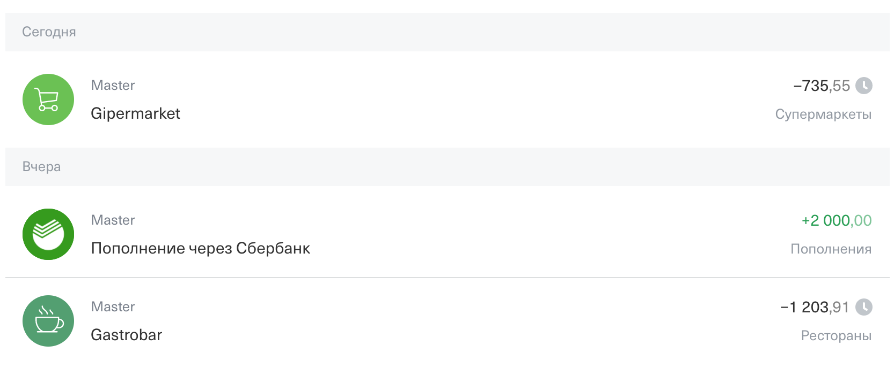
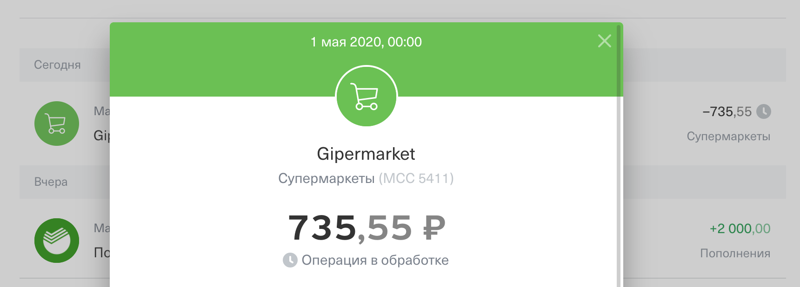

# Домашнее задание к занятию «1.3. Структуры, указатели, массивы, slices, maps»

В качестве результата пришлите ссылки на ваши GitHub-проекты в личном кабинете студента на сайте [netology.ru](https://netology.ru).

Все задачи этого занятия нужно делать в **одном репозитории**.

**Важно**: если у вас что-то не получилось, то оформляйте Issue [по установленным правилам](../report-requirements.md).

**ВАЖНО**: НИ В КОЕМ СЛУЧАЕ НЕ ПОДСТАВЛЯЙТЕ ДАННЫЕ СВОИХ РЕАЛЬНЫХ КАРТ В КОД! Это очень частая "оплошность", когда разработчики случайно коммитят и заливают на GitHub "чувствительные" (sensitive) данные (ключи, логины, пароли, адреса и т.д.). Используйте генераторы вроде: https://www.freeformatter.com/credit-card-number-generator-validator.html

Если вы всё же "случайно" залили чувствительные данные на GitHub, то используйте [инструкцию по удалению данных](https://help.github.com/en/github/authenticating-to-github/removing-sensitive-data-from-a-repository). Кроме того, как бы это печально не было, рекомендуем вам заблокировать карту и заказать в банке новую.

## Как сдавать задачи

1. Создайте на вашем компьютере Go-модуль (см. доп.видео к первой лекции)
1. Инициализируйте в нём пустой Git-репозиторий
1. Добавьте в него готовый файл [.gitignore](../.gitignore)
1. Добавьте в этот же каталог остальные необходимые файлы (убедитесь, что они аккуратно разложены по пакетам)
1. Удостоверьтесь, что вы правильно отформатировали файлы (см. раздел Форматирование из [первого ДЗ](../01_std))
1. Сделайте необходимые коммиты
1. Создайте публичный репозиторий на GitHub и свяжите свой локальный репозиторий с удалённым
1. Сделайте пуш (удостоверьтесь, что ваш код появился на GitHub)
1. Ссылку на ваш проект отправьте в личном кабинете на сайте [netology.ru](https://netology.ru)
1. Задачи, отмеченные, как необязательные, можно не сдавать, это не повлияет на получение зачета (в этом ДЗ все задачи являются обязательными)

## Предисловие

Сегодня мы отработаем типичную ситуацию из жизни программиста: код, который вы напишите, будет занимать несколько десятков строк, но перед тем, как вы его напишите, вам придётся прочитать гораздо больше.

Кроме того, мы специально вынесли описание работы с `map` и операции слайсинга из лекции, чтобы вы потихоньку привыкали к самостоятельной работе с информацией (ведь наша задача – не рассказать вам "всё", а научить, в том числе работать с информацией).

В любом случае, если что-то будет непонятно, не стесняйтесь, пишите в Slack.

## Задача №1 - Транзакции

### Легенда

Каждый раз, когда клиент совершает покупки, в историю транзакций попадает соответствующая запись:



Скриншоты взяты из Интернет Банка Тинькофф

Мы предлагаем вам попробовать спроектировать типы для представления этих транзакций.

Вы можете решать задачу в "упрощённом варианте": учитываются только траты (1 и 3 запись со скриншота, соответственно).

Вы можете решать задачу в "усложнённом варианте": учитываются все транзакции (включая пополнения). В этом случае вам нужно будет подумать, как хранить информацию о том, что это пополнение или покупка (можете ещё задуматься на тему того, а как представить "возврат").

**Важно**: задача проектирования типов не имеет единственно верного решения, мы хотим, чтобы вы подумали над проблемой и предложили решение (включая, возможно, собственный опыт).

Что вам нужно сделать:

###### Часть 1. Создайте новый тип `Transaction` внутри пакета `card` с нужными полями: пусть id пока будет `int64`, нам также понадобится сумма транзакции, дата в формате unix timestamp*, код MCC (`string`**) а ещё статус (давайте пока будем хранить в виде `string`):



Примечание*: формат unix timestamp предполагает хранение количества секунд (или миллисекунд), прошедших с первого января 1970 года по UTC. Хранение в подобном формате решает проблему с часовыми поясами, потому что значение unix timestamp не зависит от часового пояса.

Примечание**: мы предлагаем вам хранить пока MCC в виде строки, поскольку есть [MCC, начинающиеся с 0](https://www.citibank.com/tts/solutions/commercial-cards/assets/docs/govt/Merchant-Category-Codes.pdf) (если ссылка недоступна, см. [локальную копию](assets/MCC.pdf)).

###### Часть 2. Создайте внутри типа `Card` поле `transactions`, в котором будет слайс из транзакций (достаточно его объявить вот так: `transactions: []Transaction` либо `transactions: []*Transaction` - на ваше усмотрение это будут либо значения, либо указатели) а при инициализации положить туда несколько транзакций:

```go
func main() {
    master := &card.Card{
        // данные карты
        Transactions: // TODO: слайс с двумя или тремя элементами (нужно отобразить те, что на скриншотах - время выберите сами)
    }
    fmt.Println(master)
}
```

###### Часть 3. Написать функцию `AddTransaction` (конечно же в пакете `card`), которая имеет следующее объявление:

```go
func AddTransaction(card *Card, transaction *Transaction) {
    // TODO: ваш код
} 
```

Пока не думайте о том, что транзакции добавляются в конец слайса (будем считать, что за вывод в обратном порядке будет отвечать другой код).

###### Часть 4. Написать `SumByMCC` (конечно же в пакете `card`), которая имеет следующее объявление:

```go
func SumByMCC(transactions []Transaction, mcc []string) int64 {
    // TODO: ваш код
} 
```

Функция должна рассчитывать сумму только тех транзакций, MCC-код которых содержится в переданном слайсе MCC-кодов (на базе этого строится расчёт кэшбека или бонуса по категориям).

<details>
  <summary>Подсказка</summary>
  
  Вы можете написать вспомогательную функцию, которая будет возвращать `true` или `false` для ответа на вопрос: "содержится ли MCC-код конкретной транзакции в слайсе MCC-кодов".
</details>


Итого, у вас должно быть:
1. Оформленный проект с пакетами
1. Типы `Card` и `Transaction`
1. Функция `AddTransaction`
1. Пример использования типов `Card` и `Transaction` в `main` (можете просто их распечатать)
1. Пример использования функции `AddTransaction` в `main` (добавьте в карту новую транзакцию)
1. Пример использования функции `SumByMCC` в `main`

<details>
  <summary>Подсказки</summary>
  
  По MCC:
  * 5411 – для супермаркетов
  * 5812 – для ресторанов
  
  А вот для пополнений MCC нет, поскольку это не покупка.
  
  Кроме того, вы можете объявить свой тип `MCC` на базе типа `string` и использовать его везде вместо `string` (как и `Money` на базе `int64` - но тут вопрос, должен ли этот тип лежать в пакете `card`, возможно, ему место в пакете `money`). Это будет более профессиональным решением.
</details>

## Задача №2 - MCC

### Легенда

Транзакции с кодами, суммами и всем остальным – это хорошо. Но пользователи любят человекопонятные слова, а не коды.

Например, если вы покажете пользователю код MCC 5411 – ему это, скорее всего, ничего не скажет.

Ему будет понятнее, если вы напишите "Супермаркеты" вместо 5411.

Вы можете задать вполне логичный вопрос: "почему бы тогда сразу не писать Супермаркеты?". Всё дело в том, что представление вывода может осуществляться на разных языках (как минимум, английский и русский), поэтому хранится именно код (который никак не привязан к языку), а не перевод.

И отдельно хранится сопоставление кода переводу. 

А теперь подумаем, мы можем это сделать в виде:
1. Массива
1. Слайса
1. Map'а

В случае массивов и слайсов нам будет не совсем удобно, поскольку придётся перебирать все элементы в цикле и смотреть на их коды (а ещё нужно будет создать структуру, в которой сопоставлять MCC конкретному переводу).

Если задуматься, то `map` - как раз это и делает*, сопоставляет некоторому ключу аргументы.

Примечание*: нужно отметить, что в реальных системах переводы достаточно редко "зашивают" прямо в код, чаще всего их хранят в виде отдельных файлов. Но эти файлы так или иначе должны быть прочитаны приложением и внутри вполне себе могут храниться (и достаточно часто хранятся) в виде `map`. Именно поэтому мы и рассматриваем этот вариант.

Как работать с `map`? Почти так же, как со слайсами, но есть свои нюансы.

Давайте по порядку.

### Объявление

Объявлять можно 3-мя способами

#### Способ 1:

```go
var mcc map[string]string // первый string - тип ключа, второй - тип значений
```

#### Способ 2:

```go
mcc := map[string]string{
    "5411": "Супермаркеты",
    "5533": "Автоуслуги",
    "5912": "Аптеки",
}
```

#### Способ 3:

```go
mcc := make(map[string]string)
```

Либо с указанием первоначальной ёмкости:

```go
mcc := make(map[string]string, 3) // рекомендуется только если вы знаете приблизительное количество данных
```

### `len` & `cap`

**Важно**: с `map` (не важно, каким способом вы его объявили) работает только функция `len`, она показывает, сколько есть элементов:

```go
size := len(mcc)
```

**Важно**: нет публичного API для получения текущей ёмкости `map`.

### Запись значений

Запись значений осуществляется достаточно просто – вы указываете ключ и значение к нему (при этом `map` автоматически расширяется при необходимости):

```go
mcc["4111"] = "Транспорт"
```

При этом, если по такому ключу уже существовало какое-то значение, оно будет заменено на новое (т.е. в `map` ключи уникальны и не может быть двух одинаковых ключей, а вот значений – вполне себе, например, MCC-коды 5411 и 5499 могут одинаково переводиться как "Супермаркеты"). 

### Чтение значений

С чтением значений всё гораздо интереснее, есть целых два варианта:

```go
value := mcc["4111"]
// и
value, ok := mcc["4111"]
```

В чём разница? Разница в обработке ситуации с отсутствующим ключом. В отличие от `slice` (который при неверном индексе приводит к аварийному завершению программы*), в `map` вам будет возвращено нулевое значение для типа хранящихся значений `map[string]`**string** (в нашем случае – пустой строке).

И вот тут возникает проблема: либо такого ключа не существовало, либо ключ существовал, но значение действительно пустая строка.

Чтобы разграничить эти варианты, есть вторая форма записи (с `ok`), где в `ok` кладётся `true`, если ключ существует, и `false` – если нет.

Примечание*: на самом деле к панике, но мы пока это называем "аварийное завершение"

### Перебор значений

Для перебора значений используется цикл `for` (других в Go нет) + `range`:
```go
for key, value := range mcc {
    // в key - ключ
    // в value - значения
}
```

### Удаление по ключу

Для удаления по ключу существует специальная builtin-функция `delete` (работает только с `map`):
```go
delete(mcc, "4111")
```

При этом:
1. Если такой ключ существовал, он и значение, к нему привязанное будут удалены
1. Если ключа не было, то ничего не произойдёт

### Особенности

`map` внутри устроен ещё более хитро, чем `slice`. Для интереса, вы можете посмотреть это видео: https://www.youtube.com/watch?v=Tl7mi9QmLns (оно может показаться тяжёлым, но полезно для ознакомления).

Нас будут интересовать только одна особенность: `map` – это структура, которая внутри хранит указатель на массив с данными. Поэтому в функции достаточно передавать сам `map` (по значению, как слайсы) – изменения данных всё равно будут происходить.

### Задача

Вам дана следующая заготовка (пакет `card` файл `mcc.go`):

```go
package card

func TranslateMCC(code string) string { 
    // представим, что mcc читается из файла (научимся позже)
    mcc := map[string]string{
        // TODO: ваш код (необходимые вам MCC-коды)
    }

    // TODO: ваш код
}
```

Допишите в этом файле код таким образом, чтобы мы могли из `main` использовать его вот так:

```go
func main() {
    // TODO: объявление карты и транзакций
    // master = &card.Card{...}
    category := card.TranslateMCC(master.Transactions[0].MCC) 
}
```

Функция `TranslateMCC` должна:
1. Возвращать значение из `map`, если код существует
1. Возвращать строку "Категория не указана", если кода в `map` не найдено

Итого, у вас должно быть:
1. Проект из первой задачи
1. "Дополнение" к нему в виде Pull-Request'а с функциональностью перевода MCC (продемонстрируйте вызов этой функции в `main` или через Example)

В ЛК присылайте ссылку на Pull-Request.

## Задача №3 - Последние транзакции

**Важно**: это необязательная задача, её невыполнение не влияет на получение зачёта.

Это усложнённая задача для тех, кто чувствует в себе силы. Не переживайте, если не сможете её выполнить, когда мы познакомимся с базами данных, эта задача будет решаться в одну строчку (один запрос к базе).

### Легенда

Когда вы заходите в интерфейс приложения, то вам показываются не самые первые покупки, а, допустим, последние 3:


Мы хотим сделать нечто подобное.

Для этого у нас есть операция "слайсинга", когда мы можем получить новый слайс из существующего слайса или массива (данные при этом не копируется, создаётся новая структура слайса с указателем на тот же самый массив).

Операция слайсинга выглядит достаточно просто:
```go
firstOps := card.Transactions[0:3] // первые три, начиная с 0, но не включая 3 (т.е. 0, 1, 2)
```

**Важно**: и `firstOps` и `cardTransactions` указывают на те же самые данные, поэтому если поменять данные в `firstOps`, то они поменяются и в `card.Transactions`. Это будет верно до тех пор, пока не произойдёт выделения нового массива для одного из слайсов.

Для операции слайсинга есть ряд сокращений:
1. Если начинаем с нуля, то 0 можно не указывать: `card.Transactions[:3]` равносильно `card.Transactions[0:3]`
1. Если идём до конца, то "конец" можно не указывать: `card.Transactions[3:0]` равносильно `card.Transactions[3:len(card.Transactions)]`
1. Исходя из первых двух: `card.Transactions[:]` равносильно `card.Transactions[0:len(card.Transactions)]`

Ключевой момент: если в `card.Transactions` не было элементов, либо он был пустым (nil-слайс), мы получим ошибку выполнения:
```
panic: runtime error: slice bounds out of range [:3] with capacity 0
```

Поэтому нужно сначала проверить `len`* (есть ли в слайсе что-то).

Примечание*: на самом деле, если вы создадите слайс вот так: `items := make([]int, 0, 10)` то вы вполне сможете выполнить слайсинг вот так: `ops := items[:3]` и возьмёте первые три элемента (они будут нулями). Т.е. именно выход за границы `capacity` приводит к ошибке. Но когда вы хотите работать именно с данными из `items`, смотреть надо на `len`.

Что нужно сделать: на базе полученных знаний об операции слайсинга написать функцию `LastNTransactions(card *Card, n int) []Transactions` (в пакете `card`).

Что делает эта функция:
1. Берёт последние n-транзакций по карте (если в карте транзакций меньше, чем `n`, то берёт столько, сколько есть)
2. "Переворачивает" (следите за тем, чтобы случайно не **перевернуть данные** в оригинальной истории `card.Transactions`)
3. Отдаёт вызывающему коду (перевёрнутые данные)

Итого, у вас должно быть:
1. Проект из первой задачи
1. "Дополнение" к нему в виде Pull-Request'а с функциональностью вывода последних трёх транзакций (продемонстрируйте вызов этой функции в `main` или через Example)

В ЛК присылайте ссылку на Pull-Request.

Что можно посмотреть, чтобы успешно выполнить эту задачу:
1. Встроенные функции `len`, `copy`, `make`
1. [Slice Tricks](https://github.com/golang/go/wiki/SliceTricks) – сборник различных трюков по работе со слайсами

## Дополнительное чтение

Если вы хотите "глубже" разобраться в механике работы слайсов, рекомендуем вам почитать [Go Slices: usage and internals](https://blog.golang.org/slices-intro) и [Arrays, slices (and strings): The mechanics of 'append'](https://blog.golang.org/slices)

