# Домашнее задание к занятию «2.1. Методы и автотесты»

В качестве результата пришлите ссылки на ваши GitHub-проекты в личном кабинете студента на сайте [netology.ru](https://netology.ru).

Все задачи этого занятия нужно делать в **одном репозитории**.

**Важно**: если у вас что-то не получилось, то оформляйте Issue [по установленным правилам](../report-requirements.md).

**ВАЖНО**: НИ В КОЕМ СЛУЧАЕ НЕ ПОДСТАВЛЯЙТЕ ДАННЫЕ СВОИХ РЕАЛЬНЫХ КАРТ В КОД! Это очень частая "оплошность", когда разработчики случайно коммитят и заливают на GitHub "чувствительные" (sensitive) данные (ключи, логины, пароли, адреса и т.д.). Используйте генераторы вроде: https://www.freeformatter.com/credit-card-number-generator-validator.html

Если вы всё же "случайно" залили чувствительные данные на GitHub, то используйте [инструкцию по удалению данных](https://help.github.com/en/github/authenticating-to-github/removing-sensitive-data-from-a-repository). Кроме того, как бы это печально не было, рекомендуем вам заблокировать карту и заказать в банке новую.

## Как сдавать задачи

1. Создайте на вашем компьютере Go-модуль (см. доп.видео к первой лекции)
1. Инициализируйте в нём пустой Git-репозиторий
1. Добавьте в него готовый файл [.gitignore](../.gitignore)
1. Добавьте в этот же каталог остальные необходимые файлы (убедитесь, что они аккуратно разложены по пакетам)
1. Удостоверьтесь, что вы правильно отформатировали файлы (см. раздел Форматирование из [первого ДЗ](../01_std))
1. Сделайте необходимые коммиты
1. Создайте публичный репозиторий на GitHub и свяжите свой локальный репозиторий с удалённым
1. Сделайте пуш (удостоверьтесь, что ваш код появился на GitHub)
1. Ссылку на ваш проект отправьте в личном кабинете на сайте [netology.ru](https://netology.ru)
1. Задачи, отмеченные, как необязательные, можно не сдавать, это не повлияет на получение зачета (в этом ДЗ все задачи являются обязательными)

## Предисловие

Мы потихоньку будем разбирать всё более сложные и взаимодействующие друг с другом системы, потому что именно тем, насколько просто вы способны воплощать сложные системы реального мира в коде, определяется ваш уровень компетенций.

## Задача №1 - Card2Card

### Легенда

Мы продолжаем "совершенствовать" наш банк, наполняя его новыми функциями. Одна из функций, которую было решено внедрить – перевод с карты на карту (скриншот сервиса Тинькофф Банк):

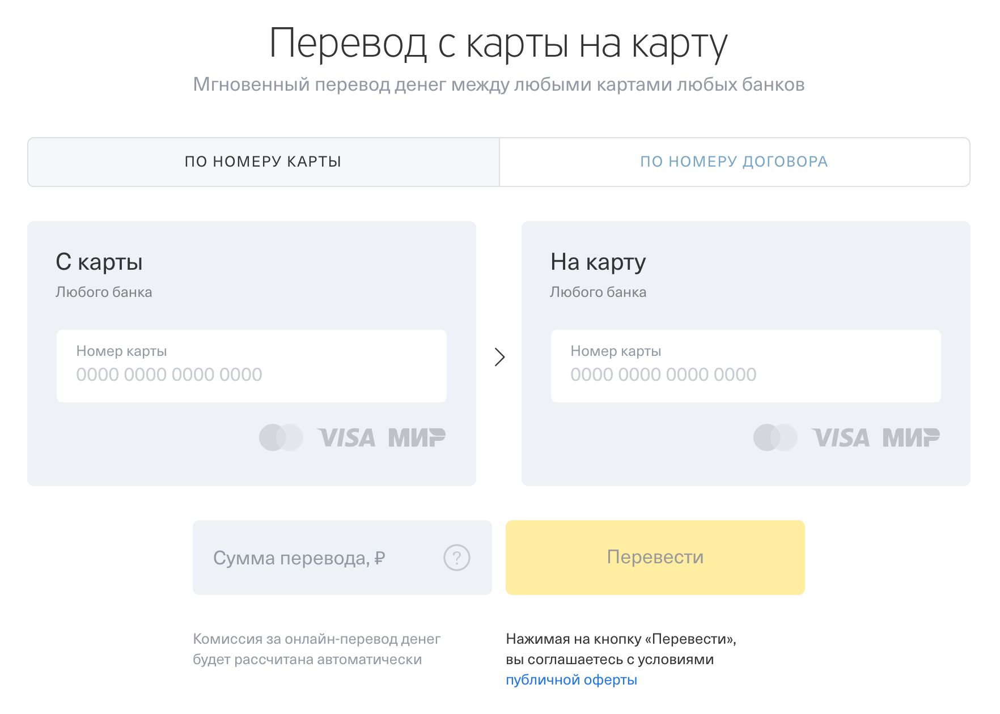

Итак, что у нас есть:
1. Возможность ввести номер карты отправителя
1. Возможность ввести номер карты получателя
1. Возможность ввести сумму перевода в рублях*

Примечание*: вообще говоря с рублями хитрая история, на самом деле можно ввести с точностью до копейки (поэтому всегда уточняйте детали):


Далее: переводы не всегда бесплатные, поэтому смотрим комиссию:

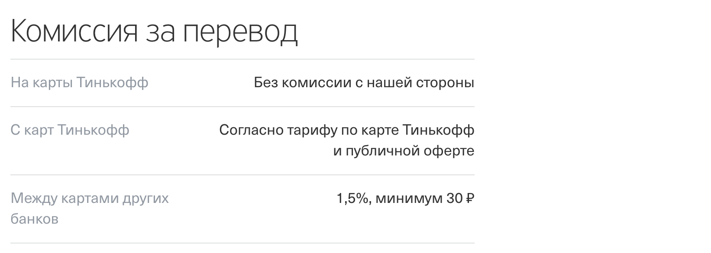

Если первое и последнее понятно, то вот со вторым проблема. Нет точного числа и зависит от карты. Поэтому мы немного упростим и сделаем в рамках нашего ДЗ вот так: 0.5%, минимум 10 рублей.

Теперь осталось это всё связать и поставить задачу:

1\. У вас должен быть пакет `card`, в котором должен быть сервис. Этот сервис хранит только карты нашего банка (в примерах – Тинькофф)

2\. У вас должен быть пакет `transfer`, в котором должен быть сервис. Этот сервис в одном из полей хранит указатель на сервис карт:

```go
package transfer

type Service struct {
    CardSvc *card.Service
    // поля для хранения:
    // комиссий в процентах и минимума в рублях*
}

func NewService(cardSvc *card.Service, /* значения для полей комиссий в процентах и минимума в рублях */) *Service {
	return &Service{/* ваш код */}
}
```

Примечание*: обратите внимание, сколько бы ни писали "в рублях", всё равно хранить внутри надо в копейках.

3\. В этом сервисе должен быть метод `Card2Card`, который и занимается переводом:

```go
func (s *Service) Card2Card(from, to string, amount int) (total int, ok bool) {
    // TODO: ваш код    
}
```

### Как работает перевод?

Алгоритм перевода работает следующим образом:
1. Ищем карту по номеру `from` среди "своих" карт (т.е. это наш банк выпустил эту карту)
1. Ищем карту по номеру `to` среди "своих" карт (т.е. это наш банк выпустил эту карту)
1. Определяем комиссию
1. Если у нас есть карта `from` и на ней достаточно средств, то списываем с неё деньги в размере `amount` + комиссия
1. Если у нас есть карта `to`, то зачисляем на неё деньги в размере `amount`
1. Возвращаем в `total`* итоговую сумму (`amount` + комиссия) а в `ok` - `true`

Примечание*: вы можете использовать неименованные возвращаемые значения, мы их поименовали только для понятности

Вопросы:
1. Что если `from` и `to` не найдены? Тогда считаем, что это перевод с карты чужого банка на карту чужого банка и просто возвращаем итоговую сумму (с комиссией) и `ok` = `true`
1. Что если не найден только `from` или только `to`? Тогда уменьшаем/увеличиваем баланс только нашей карты, возвращаем итоговую сумму (с комиссией) и `ok` = `true`
1. Что если денег на карте `from` меньше, чем нужно для перевода? Тогда возвращаем итоговую сумму (с комиссией) и `ok` = `false`

Поиск по номеру карты должен осуществлять сервис карт (из пакета `card`).

<details>
  <summary>Для тех, кто хочет б́ольшего 😈</summary>
  
  Вы можете вспомнить, что мы говорили ещё про транзакции, и можете при каждом переводе регистрировать транзакцию.
  
  Но в этот раз попробуйте эти самые транзакции хранить не в самой карте (ведь у вас может и не быть карты, если это перевод с карты стороннего банка на карту стороннего банка - вот так вот мы построили систему), а в отдельном пакете и сервисе.
  
  **Важно**: это не обязательно к реализации, только если вам интересно это сделать.
</details>

Итого, у вас должно быть: оформленный проект с пакетами, выложенный в репозиторий на GitHub.

Примечания: мы не рассматриваем всей сложности системы, поскольку пока не готовы к ней и оставляем вопросы, связанные с корректной обработкой ошибок и безопасностью, на будущее.

## Задача №2 - Автотесты

### Легенда

Вы прониклись идеей написания автотестов и решили покрыть свой код тестами, но не весь, а только часть, связанную с переводами.

Используя примеры с лекций, добавьте в проект первой задачи (Card2Card) 6 автотестов, на типичные сценарии:
1. Карта своего банка -> Карта своего банка (денег достаточно)
1. Карта своего банка -> Карта своего банка (денег недостаточно)
1. Карта своего банка -> Карта чужого банка (денег достаточно)
1. Карта своего банка -> Карта чужого банка (денег недостаточно)
1. Карта чужого банка -> Карта своего банка
1. Карта чужого банка -> Карта чужого банка

Для этого вам понадобится создать в тесте сервис карт с несколькими "своими" картами и в тестовых данных комбинировать данные "своих" карт и "чужих".

Пример:
```go
cardSvc := card.NewService(...)
cardSvc.Add(/* Карта from для первого теста */)
cardSvc.Add(/* Карта to для первого теста */)
cardSvc.Add(/* Карта from для второго теста */)
// и т.д.
```

Примечание: вы можете попробовать объявить метод `Add` следующим образом:
```go
func (s *Service) Add(cards ...*Card) {
    // TODO: ваш код, где cards - это []*Card
}
```

Тогда вы сможете вызвать метод `Add` удобным образом:
```go
cardSvc := card.NewService(...)
cardSvc.Add(
    /* Карта from для первого теста */, /* Карта to для первого теста */,
    /* Карта from для второго теста */, /* Карта to для второго теста */,
    // и т.д.
)
```

**Важно**: не ленитесь на каждый тест заводить новые карты! Написание нескольких дублирующихся строк в коде теста во много раз дешевле дебаггинга в попытке отловить ту точку, где кто-то ещё поменял баланс вашей карты.

Убедитесь, что тесты запускаются и проходят, с помощью команды `go test -v ./...`, выполненной в корневом каталоге проекта.

Итого, у вас должно быть: оформленный проект с пакетами и автотестами, выложенный в репозиторий на GitHub.

Не забывайте подставлять в тесты неправильные значения, чтобы убедиться, что они "падают".

## Задача №3 - CI

Запускать тесты на своём компьютере - хорошо, а запускать их при каждом пуше в облаке – ещё лучше. Когда вы будете работать в команде, сразу будет видно, кто "сломал" сборку, а кто прислал "нерабочий PR (Pull-Request)". В этом вся прелесь командной работы 😈<!

Мы настроим CI на базе GitHub Actions - уже встроенной в GitHub системы.

После того, как вы сделали задачу №2, перейдите в ваш репозиторий на вкладку GitHub Actions:

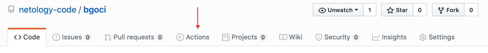

GitHub Actions (удивительно просто) уже догадался, что мы хотели бы настроить CI для Go, поэтому нам ничего не остаётся как кликнуть на кнопку Setup:


В открывшемся окне весь код нужно заменить на следующий (скопируйте и замените целиком - не переписывайте вручную):

```yml
name: Go

on:
  push:
    branches: [ master ]
  pull_request:
    branches: [ master ]

jobs:

  build:
    name: Build
    runs-on: ubuntu-latest
    steps:

      - name: Set up Go 1.x
        uses: actions/setup-go@v2
        with:
          go-version: 1.14
        id: go

      - name: Check out code into the Go module directory
        uses: actions/checkout@v2

      - name: Get dependencies
        run: |
          go get -v -t -d ./...

      - name: Build
        run: go build -v ./...

      - name: Test
        run: go test -v ./...

```

После чего нажмите на кнопки "Start commit" и "Commit new file":

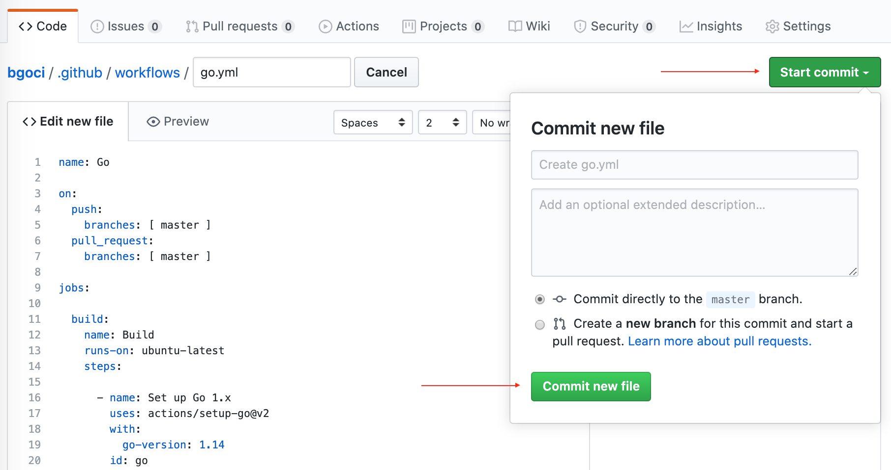

"Everything as code" и "Configuration as code" - большинство современных CI систем следуют этому подходу, когда все необходимые настройки хранятся в текстовом файле в самом репозитории. В случае GitHub Actions в вашем репозитории создастся файл `./github/workflows/go.yml`, поэтому не забудьте сделать `git pull`, чтобы он попал и в ваш локальный репозиторий.

После того, как вы закоммитите файл конфигурации, на вкладке GitHub Actions можно посмотреть прогресс выполнения:

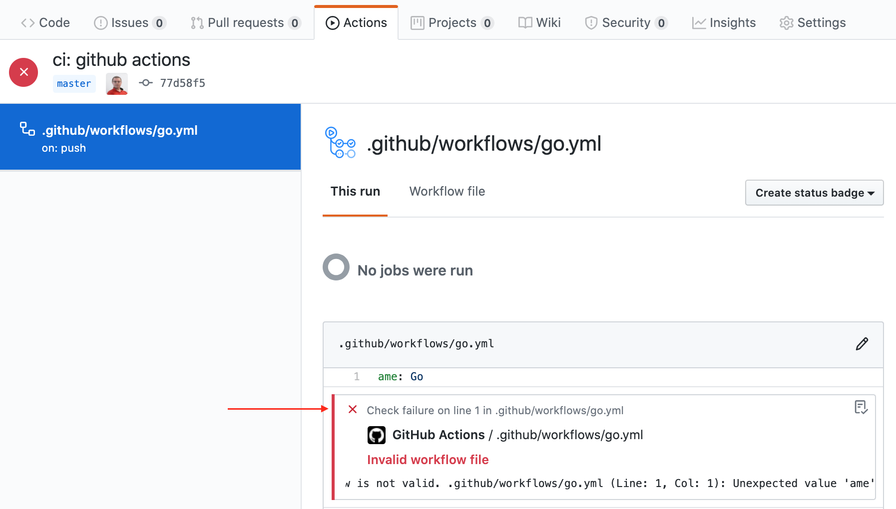

Через какое-то время получим общий итог: PASS (зелёный флажок) или FAIL (красный крестик):

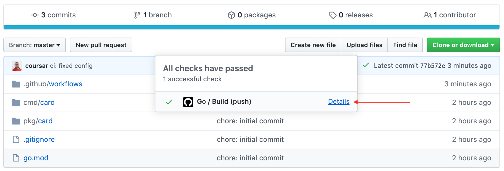

Можно "провалиться" внутрь, кликнув на названии коммита:

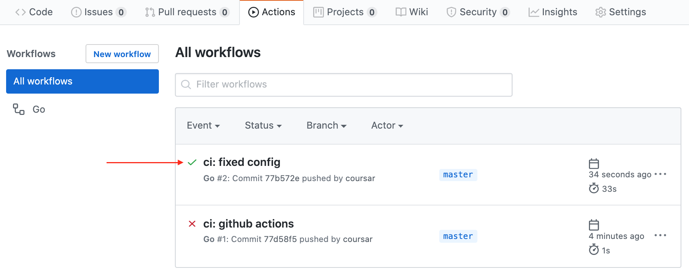

И в сами логи сборки, кликнув на ссылку "Build":

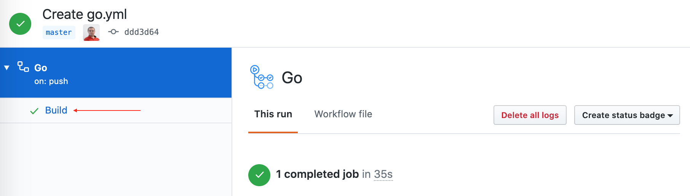

Там же можно раскрыть интересующий вас раздел и посмотреть:

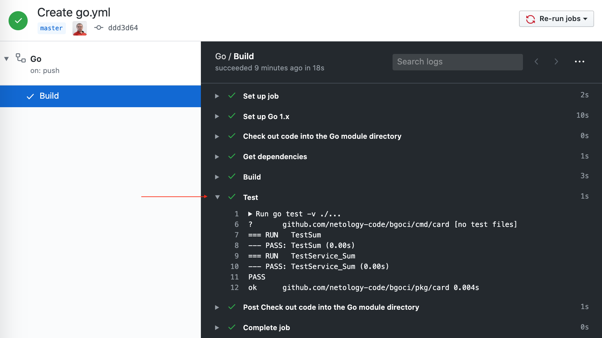

Для каждого коммита, для которого производилась сборка, на всех страницах GitHub будет отображаться статус (иконки статуса кликабельны):

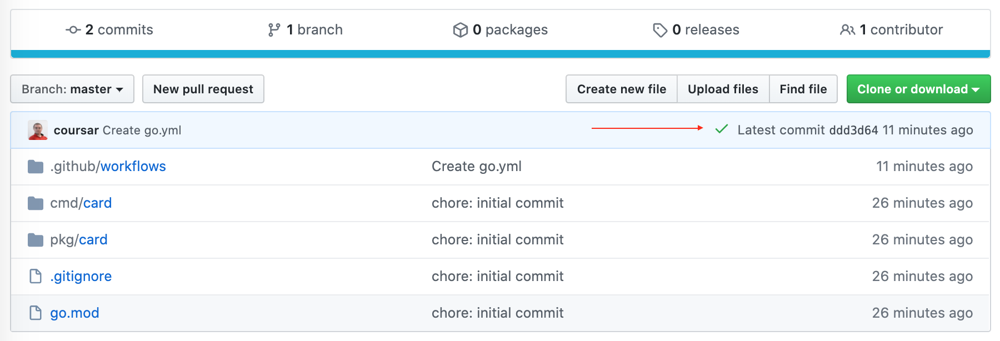

Если мы специально или случайно уроним сборку, то это тоже будет видно:

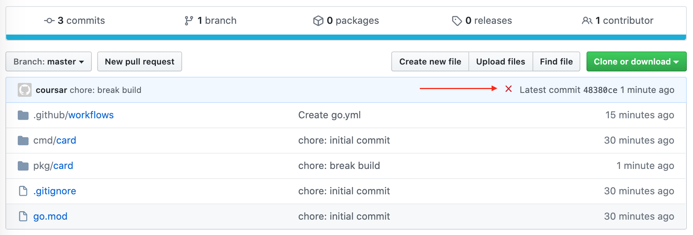

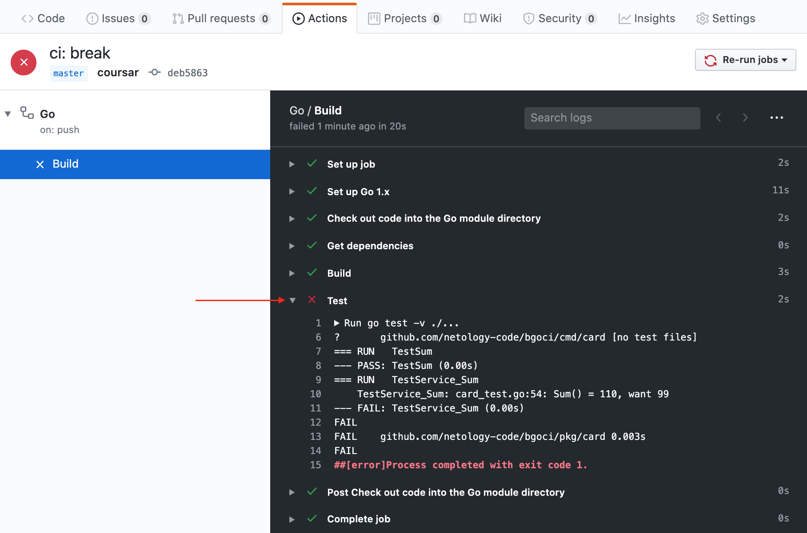

Полностью настроенный CI на основе примеров с лекции вы можете найти по адресу: https://github.com/netology-code/bgoci.

### Задача

Соответственно, ваша задача - подключить к вашему репозиторию GitHub Actions, следуя пошаговой инструкции, которая была приведена выше.

Чтобы удостовериться, что CI действительно работает - добавьте (как мы в примере) коммит, ломающий сборку (выставьте в тестах неправильное ожидаемое значение). Убедитесь, что после Push'а вам покажут эту проблему.

**Важно**: вам не нужно каждый раз создавать заново файл конфигурации GitHub Actions, достаточно добавлять его в новый репозиторий так же, как вы это делаете с `.gitignore`.

Итого, у вас должно быть:
1. Оформленный проект с пакетами и автотестами, выложенный в репозиторий на GitHub, к которому подключен GitHub Actions
1. В истории должен быть хотя бы один коммит, ломающий сборку
