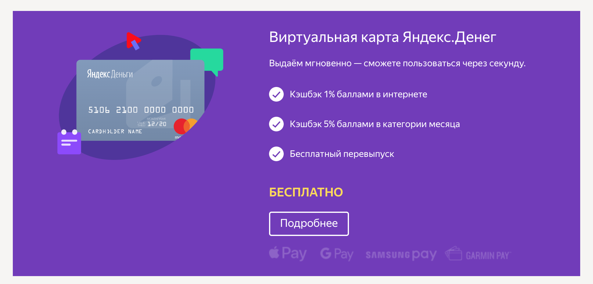

# Домашнее задание к занятию «2.2. Интерфейсы и обработка ошибок»

В качестве результата пришлите ссылки на ваши GitHub-проекты в личном кабинете студента на сайте [netology.ru](https://netology.ru).

Все задачи этого занятия нужно делать в **одном репозитории**.

**Важно**: если у вас что-то не получилось, то оформляйте Issue [по установленным правилам](../report-requirements.md).

**ВАЖНО**: НИ В КОЕМ СЛУЧАЕ НЕ ПОДСТАВЛЯЙТЕ ДАННЫЕ СВОИХ РЕАЛЬНЫХ КАРТ В КОД! Это очень частая "оплошность", когда разработчики случайно коммитят и заливают на GitHub "чувствительные" (sensitive) данные (ключи, логины, пароли, адреса и т.д.). Используйте генераторы вроде: https://www.freeformatter.com/credit-card-number-generator-validator.html

Если вы всё же "случайно" залили чувствительные данные на GitHub, то используйте [инструкцию по удалению данных](https://help.github.com/en/github/authenticating-to-github/removing-sensitive-data-from-a-repository). Кроме того, как бы это печально не было, рекомендуем вам заблокировать карту и заказать в банке новую.

## Как сдавать задачи

1. Создайте на вашем компьютере Go-модуль (см. доп.видео к первой лекции)
1. Инициализируйте в нём пустой Git-репозиторий
1. Добавьте в него готовый файл [.gitignore](../.gitignore)
1. Добавьте в этот же каталог остальные необходимые файлы (убедитесь, что они аккуратно разложены по пакетам)
1. Удостоверьтесь, что вы правильно отформатировали файлы (см. раздел Форматирование из [первого ДЗ](../01_std))
1. Сделайте необходимые коммиты
1. Создайте публичный репозиторий на GitHub и свяжите свой локальный репозиторий с удалённым
1. Сделайте пуш (удостоверьтесь, что ваш код появился на GitHub)
1. Ссылку на ваш проект отправьте в личном кабинете на сайте [netology.ru](https://netology.ru)
1. Задачи, отмеченные, как необязательные, можно не сдавать, это не повлияет на получение зачета (в этом ДЗ все задачи являются обязательными)

## Задача №1 – Card2Card Simple Errors

### Легенда

Узнав, что "ошибки нужно оформлять правильно", вы решили улучшить приложение из 4-ой лекции, которое называется Card2Card* и добавить в него поддержку ошибок.

Итак, что вам нужно сделать: вам нужно добавить ошибку и автотест на неё (не забудьте про CI для следующих случаев): денег на карте `from` (если это карта нашего банка) меньше, чем нужно

Примечание*: вам нужно привыкать к тому, что чаще всего вы будете не создавать новые проекты, а модернизировать существующие, дорабатывая и перерабатывая их. Поэтому мы будем активно этим пользоваться.

Оформите код с тестами в отдельной ветке и сделайте Pull-Request в `master` к тому коду, что расположен в репозитории (можете перенести для удобства предыдущий проект в отдельный репозиторий).

Убедитесь, что тесты для PR запускаются и проходят, с помощью команды `go test -v ./...`, выполненной в корневом каталоге проекта.

Итого, у вас должно быть: оформленный проект с пакетами и автотестами, выложенный в репозиторий на GitHub, с PR работы с ошибками.

## Задача №2 – Card Structure

### Легенда

Доработаем наш проект, добавив в него ещё пару ошибок:
1. Карта `from` не найдена (как в примере с лекции)
1. Карта `to` не найдена (как в примере с лекции)

Естественно, у вас возникает вопрос, а как же быть, если мы говорили в заданиях к предыдущей лекции, что если не найдено, то это "чужие карты".

Настало время нам с вами немного узнать про сам номер карты. Вы можете подробнее почитать на [banki.ru](https://www.banki.ru/wikibank/nomer_bankovskoy_kartyi), либо в [сохранённой копии](assets/PAN.pdf) (если banki.ru у вас по какой-то причине недоступен).

Итак, номер карты представляет собой вот такую структуру:

BBBB BBNN NNNN NNNN NNNL

* B - это идентификационный номер эмитента (того, кто выпустил карту), в который так же зашит тип карты и некоторая служебная информация
* N - это идентификационный номер самой карты
* L - контрольное число (см. задачу №3)

Список идентификационных номеров эмитентов не находится в публичном доступе, поэтому мы поступим просто, зайдём на один из официальных сайтов, которые предлагают карты и посмотрим там:



Как вы видите, он равен 5106 21. В рамках задачи, мы будем считать, что любые карты, которые начинаются так - это "наши" карты (и должны быть в нашем сервисе).

Осталось только понять, как это сделать.

Для этого вам необходимо ознакомиться с пакетом `strings` и научиться читать [документацию](https://golang.org/pkg/strings/)* (она достаточно короткая, лаконичная и с примерами). 

Вам нужно пролистать список экспортируемых функций и найти такую, которая бы возвращала `bool`, если строка с номером карты начинается на нужный нам номер.

Обратите внимание: и номер, и идентификационный номер эмитента для простоты должны быть строками. Кроме того, нас интересует именно функция отвечающая на вопрос "начинается с".

<details>
  <summary>Подсказка</summary>
  
  Если вдруг вы не нашли, то функция называется [`HasPrefix`](https://golang.org/pkg/strings/#HasPrefix)
</details>

Примечание*: навык чтения документации и ознакомления с набором доступных типов и функций очень важен, поэтому мы будем вам показывать пакеты, документацию к которым надо почитать и посмотреть на примеры.

В той же самой ветке, из которой вы сформировали Pull-Request для первой задачи, добавьте необходимые коммиты.

Убедитесь, что тесты для PR запускаются и проходят, с помощью команды `go test -v ./...`, выполненной в корневом каталоге проекта.

Итого, у вас должно быть: оформленный проект с пакетами и автотестами, выложенный в репозиторий на GitHub, с обновлённым PR (для этого ничего специального делать не нужно, сделайте просто `git push`).

## Задача №3 – Алгоритм Луна

Итак, номер карты представляет собой вот такую структуру:

BBBB BBNN NNNN NNNN NNNL

* B - это идентификационный номер эмитента (того, кто выпустил карту), в который так же зашит тип карты и некоторая служебная информация
* N - это идентификационный номер самой карты
* L - контрольное число (см. задачу №2)

Давайте же разберёмся, что за контрольное число такое.

Есть специальный [алгоритм Луна](https://ru.wikipedia.org/wiki/%D0%90%D0%BB%D0%B3%D0%BE%D1%80%D0%B8%D1%82%D0%BC_%D0%9B%D1%83%D0%BD%D0%B0) (см. Упрощённый вариант), по которому вычисляется корректность введённого номера карты (вы достаточно часто будете встречаться с приёмом, который называется [контрольное число](https://ru.wikipedia.org/wiki/Контрольное_число)).

В чём суть: берутся все предыдущие цифры и к ним применяется некий алгоритм преобразования (стандартные арифметические операторы). Затем полученное число сравнивается с контрольным - если они совпали, то всё отлично, если нет - то где-то произошла ошибка (в нашем случае, пользователь ошибся в какой-то цифре).

Чем хороши эти алгоритмы - мы можем не выполняя поиск по всем картам и не отправляя запросы в стороннюю систему, сразу провести базовую проверку и не делать лишних действий, если номер карты неверный (сразу сообщаем пользователю и ждём исправленного номера).

Теперь возникает вопрос, как же преобразовать строку в набор чисел?

В этом нам поможет снова пакет `strings`, а именно его функции:
* [`ReplaceAll`](https://golang.org/pkg/strings/#ReplaceAll), которая поможет вам заменить все пробелы `" "` на пустые строки `""` (т.е. по факту создаст новую строку без пробелов)
* [`Split`](https://golang.org/pkg/strings/#Split), который может разрезать вашу строку по разделителю, а если передать туда пустую строку `""`, то сделает вам слайс из символов вашей строки

Таким образом, мы получим слайс из цифр.

Но этого не достаточно - нам нужно перевести эти цифры из строк в числа.

Для того, чтобы осуществлять конвертацию в строки и обратно, в Go существует пакет [`strconv`](https://golang.org/pkg/strconv).

Нам из него нужна только одна функция: [`Atoi`](https://golang.org/pkg/strconv/#Atoi):

```go
func Atoi(s string) (int, error)
```

Как вы видите, функция возвращает ошибку последним значением.

<details>
  <summary>Почему доки нужно читать целиком 😈</summary>
  
  Как вы видите, `Atoi` возвращает `int`, а если бы строили систему SMS-банкинга, где вы отправляете текстом сумму перевода?
  
  `strconv` очень мощный пакет и там есть функция [`ParseInt`](https://golang.org/pkg/strconv/#ParseInt), которая позволяет точно указать, в какое представление нужно "попытаться" уместить полученное число. 
</details>

Что вам нужно сделать:
1. Нужно реализовать функцию `IsValid`, которая в соответствии с алгоритмом Луна проверяет корректность номера карты
1. Функция `IsValid` должна возвращать `false`, если не удалось конвертировать одну из цифр в `int` либо контрольная сумма не сошлась
1. Функция `Card2Card` при переводе средств должна проверять с помощью алгоритма Луна как карту `from`, так и карту `to` и возвращать новую ошибку (например, `ErrInvalidCardNumber`), в случае, если проверка не прошла

Не забудьте написать автотесты для функции `IsValid`.

<details>
  <summary>Подсказка</summary>
  
  После того, как вы получите слайс из строк, просто создайте новый слайс такого же размера, но из чисел.
  
  А дальше с помощью обычного цикла для каждого элемента из первого слайса создайте элемент во втором с помощью `strconv.Atoi`.
</details>

В той же самой ветке, из которой вы сформировали Pull-Request для первой и второй задачи, добавьте необходимые коммиты.

Убедитесь, что тесты для PR запускаются и проходят, с помощью команды `go test -v ./...`, выполненной в корневом каталоге проекта.

Итого, у вас должно быть: оформленный проект с пакетами и автотестами, выложенный в репозиторий на GitHub, с обновлённым PR (для этого ничего специального делать не нужно, сделайте просто `git push`).
