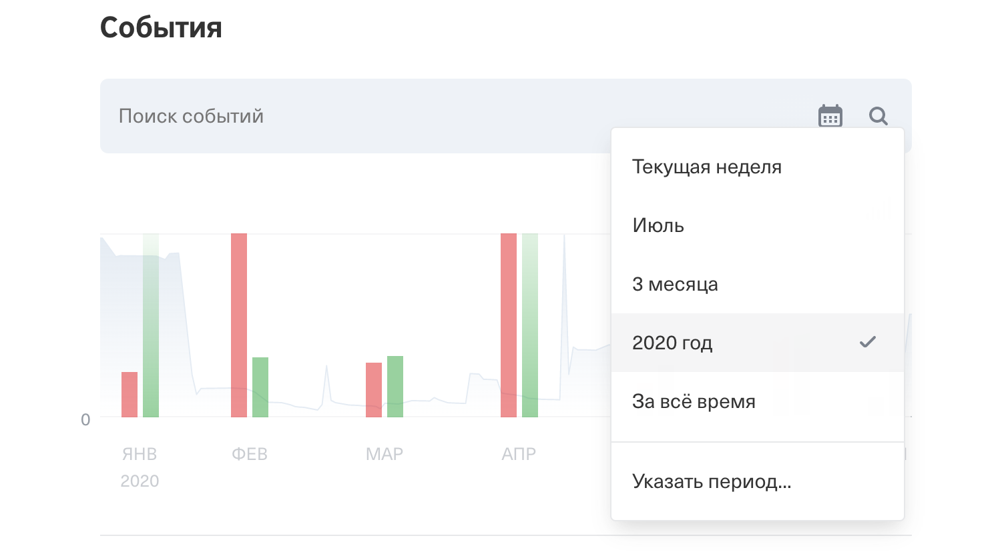
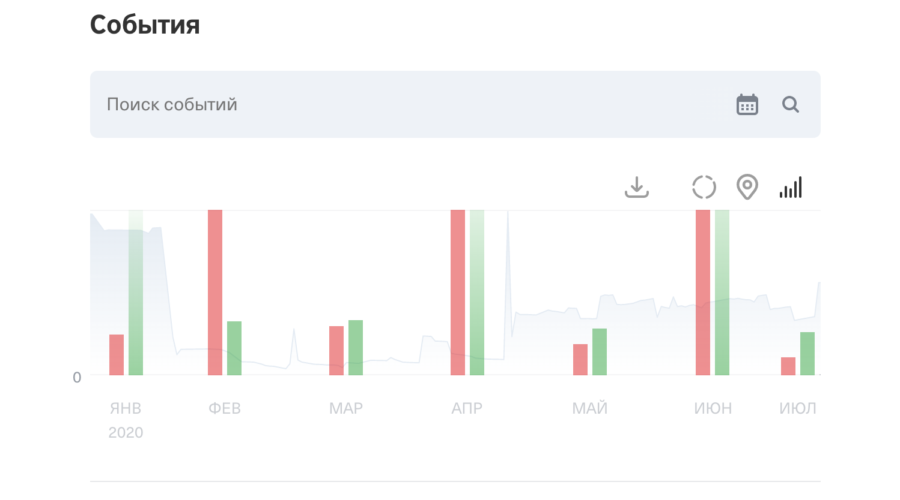
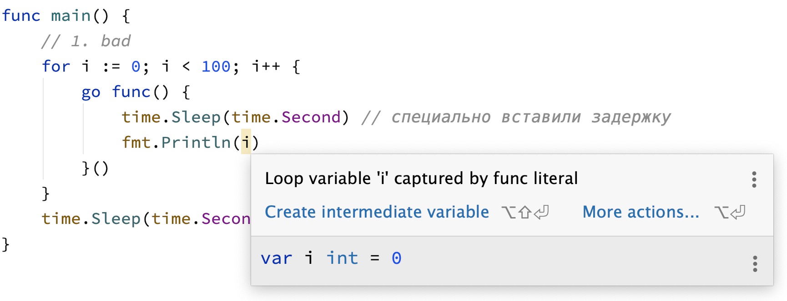

# Домашнее задание к занятию «2.3. Горутины и пакет sync»

В качестве результата пришлите ссылки на ваши GitHub-проекты в личном кабинете студента на сайте [netology.ru](https://netology.ru).

Все задачи этого занятия можно делать в **одном репозитории**.

**Важно**: если у вас что-то не получилось, то оформляйте Issue [по установленным правилам](../report-requirements.md).

**ВАЖНО**: НИ В КОЕМ СЛУЧАЕ НЕ ПОДСТАВЛЯЙТЕ ДАННЫЕ СВОИХ РЕАЛЬНЫХ КАРТ В КОД! Это очень частая "оплошность", когда разработчики случайно коммитят и заливают на GitHub "чувствительные" (sensitive) данные (ключи, логины, пароли, адреса и т.д.). Используйте генераторы вроде: https://www.freeformatter.com/credit-card-number-generator-validator.html

Если вы всё же "случайно" залили чувствительные данные на GitHub, то используйте [инструкцию по удалению данных](https://help.github.com/en/github/authenticating-to-github/removing-sensitive-data-from-a-repository). Кроме того, как бы это печально не было, рекомендуем вам заблокировать карту и заказать в банке новую.

## Как сдавать задачи

1. Создайте на вашем компьютере Go-модуль (см. доп.видео к первой лекции)
1. Инициализируйте в нём пустой Git-репозиторий
1. Добавьте в него готовый файл [.gitignore](../.gitignore)
1. Добавьте в этот же каталог остальные необходимые файлы (убедитесь, что они аккуратно разложены по пакетам)
1. Удостоверьтесь, что вы правильно отформатировали файлы (см. раздел Форматирование из [первого ДЗ](../01_std))
1. Сделайте необходимые коммиты
1. Создайте публичный репозиторий на GitHub и свяжите свой локальный репозиторий с удалённым
1. Сделайте пуш (удостоверьтесь, что ваш код появился на GitHub)
1. Ссылку на ваш проект отправьте в личном кабинете на сайте [netology.ru](https://netology.ru)
1. Задачи, отмеченные, как необязательные, можно не сдавать, это не повлияет на получение зачета (в этом ДЗ все задачи являются обязательными)

## Задача №1 - Сортировка

Эта задача не относится к горутинам, она относится только к замыканиям.

Суть заключается в следующем: достаточно часто пользователи хотят видеть отчёты сортируя покупки по стоимости.

Т.е. самая первая покупка - самая дорогая, потом чуть дешевле и т.д.

Мы хотим дать им такую возможность. У вас по-прежнему есть слайс из транзакций, с которым вы будете работать.

А для сортировки у нас есть пакет `sort` с замечательными функциями `Slice` и `SliceStable` (почитайте, чем они отличаются - это интересно, если коротко - то `SliceStable` гарантирует вам одинаковый порядок, что вам пригодится в тестах).

Обе имеют вот такой вид:
```go
func Slice(slice interface{}, less func(i, j int) bool) {
    ...
}
```

Давайте разбираться:
1. `slice interface{}` - это значит, что сортировать вы можете что угодно (но на самом деле, внутри идёт проверка на то, что это слайс, поэтому параметр и называется `slice`)
2. `less func(i, j int) bool` - это значит, что вы должны передать функцию, которая отвечает на вопрос "верно ли, что `i`-ый элемент в слайсе меньше, чем `j`". Т.е. `i` и `j` это именно индексы в слайсе

Функция эта достаточно умная, вы ей показываете как сравнивать два элемента из слайса, а дальше она сама.

В общем виде это выглядит примерно вот так:

```go
sort.Slice(transactions, func(i, j int) bool {
    // можете использовать transactions[i] и transactions[j]
})

// в этой точке transactions уже отсортирован
```

По умолчанию, эта функция сортирует по возрастанию (т.е. от меньшего к большему), вам же надо в другую сторону.

<details>
<summary>Подсказка</summary>

Возможно, стоит просто возвращать true вместо false и наоборот
</details>

Для автотестов используйте следующий шаблон:
```go
for _, tt := range tests {
    if got := Sort(tt.args.transactions); !reflect.DeepEqual(tt.args.transactions, tt.want) {
        t.Errorf("Sum() = %v, want %v", got, tt.want)
    }
}
```

Почему именно так: в Go нельзя сравнивать слайсы с помощью ==. Но есть `reflect.DeepEqual`, которая хоть и медленная, но умеет сравнивать любые типы, включая сравнение их полей и т.д. Её мы и будем использовать.

Альтернативой является написание собственной вспомогательной функции, определяющей равенство слайсов (цикл + поэлементная проверка).

**Важно**: если вы используете `reflect.DeepEquals`, то используйте `SliceStable`.

Итого, у вас должно быть: оформленный проект с пакетами и автотестами, выложенный в репозиторий на GitHub и автотесты.

## Задача №2 – Сумма по месяцам

### Легенда

Эта задача является усложнённым вариантом той задачи, что мы решали на лекции. Единственное, что считать вам предстоит не общую сумму, а сумму по месяцам календарного года.

Что это значит? Это значит, что вы должны делить слайс с транзакциями не по количеству элементов, а по их дате (считайте, что транзакции в слайсе уже упорядочены по дате, т.е. дополнительно их сортировать не нужно).

В графическом виде это выглядит примерно вот так (скриншоты Интернет-банка Тинькофф):





Т.е. считайте, что в вашу функцию приходит дата начала отсчёта и дата окончания (в нашем случае для июля дата окончания будет 01.08.2020 00:00:00 - это уже не относится к июлю).

Для того, чтобы задать границы, вам потребуется пакет `time`:

```go
// 01.01.2020 00:00 в локальном часовом поясе
t := time.Date(2020, 1, 1, 0, 0, 0, 0, time.Local) // Time
unix := t.Unix() // int64
```

Здесь есть важный нюанс, связанный со временем. Время клиента может отличаться от времени банка (например, в некоторых городах +2ч к Москве, а значит транзакция, которую он совершил 1 января 2020 в 00:00 по своему времени будет по Московскому времени ещё в 2019 году).

Соответственно, у вас есть два варианта:
1. Показывать в фиксированном часовом поясе (например, по Москве)
1. Показывать во времени клиента

Яркий пример второго варианта - мессенджеры, вы можете быть в разных часовы поясах, но присылаемые сообщения показываются вам вашим временем, а не временем отправителя. Ему же показываются в его времени.

Соответственно, вам нужно разделить всё по месяцам и расчёт каждого месяца запустить в отдельной горутине.

Складывать ничего не нужно, просто выводите в терминал:
```go
func SumConcurrently(transactions []int64, goroutines int) int64 {
	wg := sync.WaitGroup{}
	wg.Add(goroutines)

	total := int64(0)
	partSize := // TODO: решаете сами
	for i := 0; i < goroutines; i++ {
	        // ВАЖНО: просто с partSize не прокатит, вам нужно как-то заранее разделить слайс по месяцам
	        // ВАЖНО: этот код - лишь шаблон, который показывает вам как запустить горутину
		part := transactions[i*partSize : (i+1)*partSize]
		go func() {
			sum := Sum(part)
			fmt.Println(sum)
			wg.Done()
		}()
	}

	wg.Wait()
	return total
}
```

Итого, у вас должно быть: оформленный проект с пакетами, выложенный в репозиторий на GitHub.

Автотесты писать не нужно.

<details>
<summary>Подсказки по реализации</summary>

В зависимости от того, насколько гибким вы хотите сделать ваше решение, вы можете выбрать тот или иной подход (включая не описанный здесь).

#### Вариант в лоб

Самый простой, подход заключается в том, что вы в коде задаёте месяц старта и месяц окончания, например:

```go
start := time.Date(2020, 1, 1, 0, 0, 0, 0, time.Local)
finish := time.Date(2020, 4, 1, 0, 0, 0, 0, time.Local)
```

Исходя из этого, вы можете определить, сколько у вас всего месяцев и аккуратно сложить эти данные в слайс:
```go
start := time.Date(2020, 1, 1, 0, 0, 0, 0, time.Local)
finish := time.Date(2020, 4, 1, 0, 0, 0, 0, time.Local)

months := make([]int64, 0)

next := start
for next.Before(finish) {
    months = append(months, next.Unix())
    next = next.AddDate(0, 1, 0)
}
months = append(months, finish.Unix())
fmt.Println(months)
```

Обратите внимание, это всё работает благодаря тому, что мы берём в качестве отсчёта именно 1 число 00:00:00 каждого месяца (с 31 так работать не будет - можете проверить, почему - написано в документации на `AddDate`).

Далее, итерируясь по транзакциям, вам нужно выяснять, к какому элементу в слайсе с месяцами относится транзакция и складывать её в соответствующий "контейнер".

Например:
```go
start := time.Date(2020, 1, 1, 0, 0, 0, 0, time.Local)
finish := time.Date(2020, 8, 1, 0, 0, 0, 0, time.Local)

months := make([]*part, 0)

next := start
for next.Before(finish) {
    months = append(months, &part{
        monthTimestamp: next.Unix(),
    })
    next = next.AddDate(0, 1, 0)
}
months = append(months, &part{
    monthTimestamp: finish.Unix(),
})

transactions := make([]*Transaction, 10_000)
// TODO: заполняете transactions
for _, transaction := range transactions {
    // TODO: находите нужный месяц для совпадения
    // (для примера мы взяли первый)
    month := months[0]
    month.transactions = append(month.transactions, transaction)
}

// в итоге months - это и есть ваши готовые части, которые можно передавать в горутины
```

Где `part` это тип:

```go
type part struct {
	monthTimestamp int64
	transactions []*Transaction
}
```

**Забегая вперёд**: подумайте, можно ли самое разбиение транзакций на части "распараллелить"? Пока у нас для этого не хватит знаний, но после следующей вы вполне это сможете реализовать.

#### Вариант похитрее

Можно поступить чуть проще, если разобраться с пакетом `time`. Если мы умеем время конвертировать в unix time, то можно его конвертировать и обратно:

```go
t := time.Unix(transaction.unixTime, 0)
```

А затем уже выделить из времени компоненту месяца и (самое главное, не забывайте об этом) года:
```go
year := t.Year()
month := t.Month()
```

А потом аккуратно сгруппировать все транзакции, используя пару год-месяц в качестве ключа и уже элементы `map` отдавать горутинам на расчёт.

**Забегая вперёд** (в этой задаче это делать не нужно, т.к. вы просто выводите в каждой горутине результат расчёта): но здесь есть тонкий момент: а что если в каком-то месяце не было транзакций? При таком подходе у вас в отчёте вообще этого месяца не будет, хотя должен был быть со значением 0.

Помните мы вас учили - всегда, когда работаете с набором элементов рассматривайте три случая:
* нет элементов
* ровно один элемент
* несколько элементов

Вот вам яркий пример. Соответственно, когда вы будете решать подобные задачи со сбором итогов в единый "массив данных" (речь не о Go-массиве), помните про подобные кейсы.

</details>

## Типичная ошибка

**Важно**: это не ДЗ, сдавать его не нужно. Вы лишь должны прочитать этот раздел и убедиться, что поняли его.

Сравним три цикла:
```go
	// 1. bad
	for i := 0; i < 100; i++ {
		go func() {
			fmt.Println(i)
		}()
	}
 
	// 2. ok
	for i := 0; i < 100; i++ {
		j := i
		go func() {
			fmt.Println(j)
		}()
	}

	// 3. ok
	for i := 0; i < 100; i++ {
		go func(j int) {
			fmt.Println(j)
		}(i)
	}
```

Вроде большой разницы между первым и вторым нет, а третий вообще переусложнён.

На самом деле, разница есть и большая. Первый цикл будет работать неправильно (вы встретите дубликаты при выводе, хотя не должны были бы).

Всё дело в том, что значения "замкнутых" переменных вычисляются в момент вызова функции (т.е. когда эта функция запустится на исполнение, она найдёт переменную и возьмёт из неё то значение, которое там хранится сейчас).

Для простоты представим, что все код `fmt.Println(i)` запустится тогда, когда цикл завершился:

#### Для первого цикла:
```go
func main() {
	// 1. bad
	for i := 0; i < 100; i++ {
		go func() {
			time.Sleep(time.Second) // специально вставили задержку
			fmt.Println(i)
		}()
	}
	time.Sleep(10 * time.Second) // без WaitGroup просто задержка
}
```

Это значит, что в момент запуска `fmt.Println(i)` будет осуществлён поиск `i`. Несмотря на то, что мы вроде как уже вышли из цикла, переменная `i` не уничтожилась (поскольку к ней обращаются из вложенной функции).

Переменная `i` создавалась всего одна, поэтому все горутины будут обращаться к ней. Поскольку они будут обращаться к ней уже после завершения цикла, то в `i` будет значение 100.

Это важно запомнить - одна из типичных ошибок. GoLand будет вас о ней предупрежать:



#### Для второго цикла:
```go
func main() {
	for i := 0; i < 100; i++ {
		j := i	
		go func() {
			time.Sleep(time.Second) // специально вставили задержку
			fmt.Println(j)
		}()
	}
	time.Sleep(10 * time.Second) // без WaitGroup просто задержка
}
```

Это значит, что в момент запуска `fmt.Println(i)` будет осуществлён поиск `j`. Несмотря на то, что мы вроде как уже вышли из всех итераций цикла, переменная `j` не уничтожилась (поскольку к ней обращаются из вложенной функции).

Но переменная `j` создавалась не один раз, а ровно столько, сколько было итераций цикла. Поэтому у каждой горутины будет своя `j`, в которой будет сохранено значение `i` на момент прохождения цикла.

Таким образом, всё отработает корректно.

#### Для третьего цикла:
```go
func main() {
	for i := 0; i < 100; i++ {
		go func(j int) {
			time.Sleep(time.Second) // специально вставили задержку
			fmt.Println(j)
		}(i)
	}
	time.Sleep(10 * time.Second) // без WaitGroup просто задержка
}
```

В данном случае, на каждой итерации цикла `i` передаётся в качестве аргумента в функцию (а значит, копируется), соответственно функция при вызове не будет ничего искать во внешней области видимости.

В функцию попадёт верное значение (т.к. значение будет передаваться в момент вычисления аргумента).

Таким образом, всё отработает корректно.

