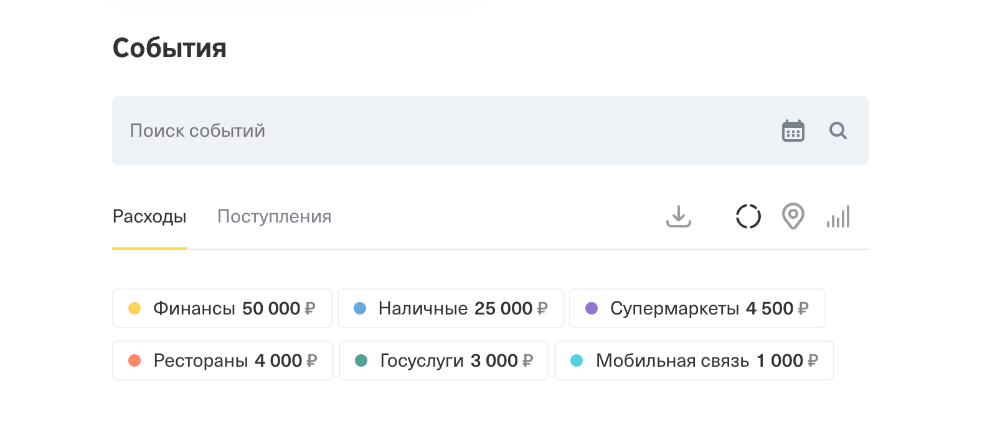
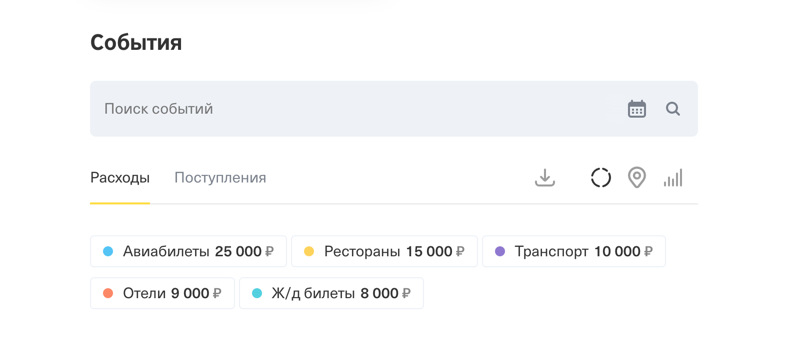
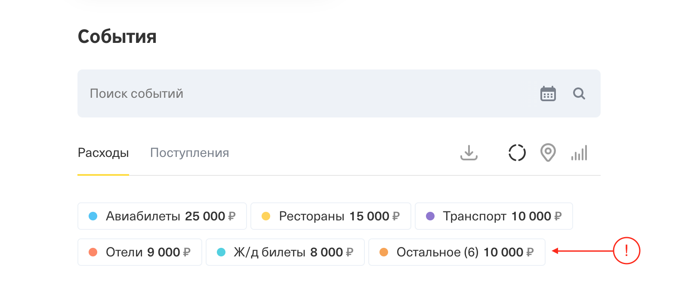

# Домашнее задание к занятию «2.4. Каналы и контекст»

В качестве результата пришлите ссылки на ваши GitHub-проекты в личном кабинете студента на сайте [netology.ru](https://netology.ru).

Все задачи этого занятия нужно делать в **разных репозиториях**.

**Важно**: если у вас что-то не получилось, то оформляйте Issue [по установленным правилам](../report-requirements.md).

**ВАЖНО**: НИ В КОЕМ СЛУЧАЕ НЕ ПОДСТАВЛЯЙТЕ ДАННЫЕ СВОИХ РЕАЛЬНЫХ КАРТ В КОД! Это очень частая "оплошность", когда разработчики случайно коммитят и заливают на GitHub "чувствительные" (sensitive) данные (ключи, логины, пароли, адреса и т.д.). Используйте генераторы вроде: https://www.freeformatter.com/credit-card-number-generator-validator.html

Если вы всё же "случайно" залили чувствительные данные на GitHub, то используйте [инструкцию по удалению данных](https://help.github.com/en/github/authenticating-to-github/removing-sensitive-data-from-a-repository). Кроме того, как бы это печально не было, рекомендуем вам заблокировать карту и заказать в банке новую.

## Как сдавать задачи

1. Создайте на вашем компьютере Go-модуль (см. доп.видео к первой лекции)
1. Инициализируйте в нём пустой Git-репозиторий
1. Добавьте в него готовый файл [.gitignore](../.gitignore)
1. Добавьте в этот же каталог остальные необходимые файлы (убедитесь, что они аккуратно разложены по пакетам)
1. Удостоверьтесь, что вы правильно отформатировали файлы (см. раздел Форматирование из [первого ДЗ](../01_std))
1. Сделайте необходимые коммиты
1. Создайте публичный репозиторий на GitHub и свяжите свой локальный репозиторий с удалённым
1. Сделайте пуш (удостоверьтесь, что ваш код появился на GitHub)
1. Ссылку на ваш проект отправьте в личном кабинете на сайте [netology.ru](https://netology.ru)
1. Задачи, отмеченные, как необязательные, можно не сдавать, это не повлияет на получение зачета (в этом ДЗ все задачи являются обязательными)

## Предисловие

Ключевой темой ДЗ будет являться работа с mutex'ами и каналами, а также написание бенчмарков на наш код. Это позволит вам "примерно" сравнивать скорость работы разных подходов.

Обратите внимание: если у вас ноутбук или вы параллельно с прогоном бенчмарков слушаете музыку/смотрите видео, то результаты будут в буквальном смысле "скакать".

Кроме того, нужно чётко понимать, а что вы конкретно измеряете: например, если вы меряете скорость каналов vs скорость mutex'ов, то нужно понимать, что у вас должно быть много пересылок по каналам и много mutex'ов. В противном случае, другие действия (суммирование например) будет занимать настолько больше времени, что влияние mutex'ов или пересылки по каналам вообще не скажется на фоне общей картины.

## Задача №1 - Расходы по категориям

Мы возьмём с вами идею предыдущих задач (расчёт статистики по транзакциям), но считать будем не сумму транзакций не расходы по категориям. 

Для этого вам придётся взять с пыльной полки знания об MCC и, возможно, даже ваши наработки. Хотя вы, конечно, можете обойтись без MCC и как-то хранить в транзакции категорию, но это уже ваше дело - вы автор и проектировщик программы.

Соответственно, мы хотим сделать следующую вещь: так же как на лекции у нас есть миллион транзакций (но если у нас были числа - у вас настоящие транзакции с MCC и т.д.).

Вам нужно собрать траты по категориям, примерно так, как это происходит в Интернет-Банке:



<details>
    <summary>Подсказка</summary>
    
    Обратите внимание: в личном кабинете конкретного пользователя показываются только его транзакции (а не всего банка), значит, вам нужно ещё и фильтровать их по конкретному пользователю.
</details>

Соответственно, если мы внимательно посмотрим, то у нас формат: ключ (название категории) и значение (сумма). А значит, мы можем использовать `map` для хранения, но для отображения нужен будет всё равно слайс.

<details>
    <summary>Почему слайс?</summary>
    
    Всё дело в том, что создатели Go специально сделали так, что вы не можете полагаться на порядок того, как хранятся элементы в `map` (если будете использовать `for range`).
    
    А если вы внимательно приглядитесь к выводу, то увидите, что порядок зависит от суммы: т.е. категория с большей суммой находится первее.
    
    
    
    
    
    P.S. На самом деле мы немного "наврали" и в реальной системе всё чуть хитрее, а именно какие-то категории по определённому алгоритму собираются в "Остальное" и ставятся всегда последними (но мы так не будем усложнять):
    
    
</details>

Соответственно: нам от вас нужно 5 вариантов решения (сделайте 5 функций):
1. Обычная функция, которая принимает на вход слайс транзакций и id владельца - возвращает `map` с категориями и тратами по ним (сортировать они ничего не должна)
1. Функция с mutex'ом, который защищает любые операции с `map`, соответственно, её задача: разделить слайс транзакций на несколько кусков и в отдельных горутинах посчитать map'ы по кускам, после чего собрать всё в один большой `map`. Важно: эта функция внутри себя должна вызывать функцию из п.1
1. Функция с каналами, соответственно, её задача: разделить слайс транзакций на несколько кусков и в отдельных горутинах посчитать map'ы по кускам, после чего собрать всё в один большой `map` (передавайте рассчитанные куски по каналу). Важно: эта функция внутри себя должна вызывать функцию из п.1
1. Функция с mutex'ом, который защищает любые операции с `map`, соответственно, её задача: разделить слайс транзакций на несколько кусков и в отдельных горутинах посчитать, но **теперь горутины напрямую пишут в общий `map` с результатами**. Важно: эта функция внутри себя **не должна** вызывать функцию из п.1
1. Функция с каналами, соответственно, её задача: разделить слайс транзакций на несколько кусков и в отдельных горутинах посчитать, но **теперь горутины каждую категорию отправляют по каналу**. Важно: эта функция внутри себя **не должна** вызывать функцию из п.1

Итого, у вас должно быть: оформленный проект с пакетами и тестами, выложенный в репозиторий на GitHub и автотесты.

Тесты обязательно нужны, иначе как вы проверите, что код работает правильно?

Здесь ключевой момент - подготовка тестовых данных.

Сделайте прямо в файле с тестами функцию, которая будет вам генерировать синтетические тестовые данные (всегда одни и те же - без рандома):

```go
func makeTransactions() []int64 {
	const users = 10_000
	const transactionsPerUser = 10_000
	const transactionAmount = 1_00
	transactions := make([]Transaction, users * transactionsPerUser)
	for index := range transactions {
        switch index % 100 {
            case 0:
        		transactions[index] = // Например, каждая 100-ая транзакция в банке от нашего юзера в категории такой-то
            case 20:
        		transactions[index] = // Например, каждая 120-ая транзакция в банке от нашего юзера в категории такой-то
            ...
            default:
                transactions[index] = // Транзакции других юзеров, нужны для "общей" массы
        }
	}
	return transactions
}
```

И просто используйте эту функцию в тестах вместо того, чтобы "хардкодить" данные.

## Задача №2 – Бенчмарки

Бенчмарки - это "тесты производительности". Они позволяют сравнивать несколько реализаций. Причём важны не абсолютные значения показываемых величин, а именно "относительные".

Go Tools фактически засекают, сколько требуется на один запуск вашей функции, правильно высчитывает общий показатель и позволяет вам визуально сравнить.

Важно: на одном прогоне тестировать бессмысленно! Нужно хотя бы тысячу прогонов, чтобы получить более-менее правильные числа.

Бенчмарки пишутся достаточно просто: вы в файле с тестами пишите вот такую структуру (для каждого тестируемого варианта реализации):

```go
// Сокращение GoLand: bench + Tab
func BenchmarkCategorization(b *testing.B) {
	transactions := makeTransactions()
	want := map[string]int64{
        // ожидаемые вами значения
    }
	b.ResetTimer() // сбрасываем таймер, т.к. сама генерация транзакций достаточно ресурсоёмка
	for i := 0; i < b.N; i++ {
		result := Categorize(transactions)
        b.StopTimer() // останавливаем таймер, чтобы время сравнения не учитывалось 
		if !reflect.DeepEqual(result, want) {
			b.Errorf("invalid result, got %v, want %v", result, want)
		}
        b.StartTimer() // продолжаем работу таймера
	}
}
```

Вместо `testing.T` как в обычных тестах, здесь используется `testing.B`.

И так для каждого варианта, например для конкурентного с mutex'ами:

```go
// Сокращение GoLand: bench + Tab
func BenchmarkCategorizationWithMutex(b *testing.B) {
	transactions := makeTransactions()
	want := map[string]int64{
        // ожидаемые вами значения
    }
	b.ResetTimer() // сбрасываем таймер, т.к. сама генерация транзакций достаточно ресурсоёмка
	for i := 0; i < b.N; i++ {
		result := CategorizeConcurrentlyWithMutex(transactions)
        b.StopTimer() // останавливаем таймер, чтобы время сравнения не учитывалось 
		if !reflect.DeepEqual(result, want) {
			b.Errorf("invalid result, got %v, want %v", result, want)
		}
        b.StartTimer() // продолжаем работу таймера
	}
}
```

Обратите внимание: внутри бенчмарков мы проверяем результат! Потому что в противном случаем мы можем получить, что "работает очень быстро, но не правильно".

Стоит отметить, что вы не всегда будете видеть `b.ResetTimer`, `b.StopTimer` или `b.StartTimer` - они используются только если у вас достаточно дорогие вычисления, которые могут влиять на результат.

Бенчмарки не запускаются во время прогона простых тестов. Для их запуска нужна специальная команда:

```shell
go test -bench=. -benchtime=1000x ./...
```

`-bench=.` означает, что запускаем все бенчмарки (точка).

`-benchtime=1000x` с суффиксом `x` на конце означает, что запускаем 1000 раз (по умолчанию запускаются на одну секунду). 

После этого вы получите вывод с цифрами и можете подумать, почему получилось так или иначе.

Итого, у вас должно быть: оформленный проект с пакетами и тестами, выложенный в репозиторий на GitHub и бенчмарки.
