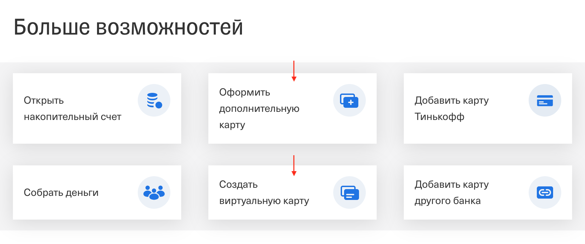
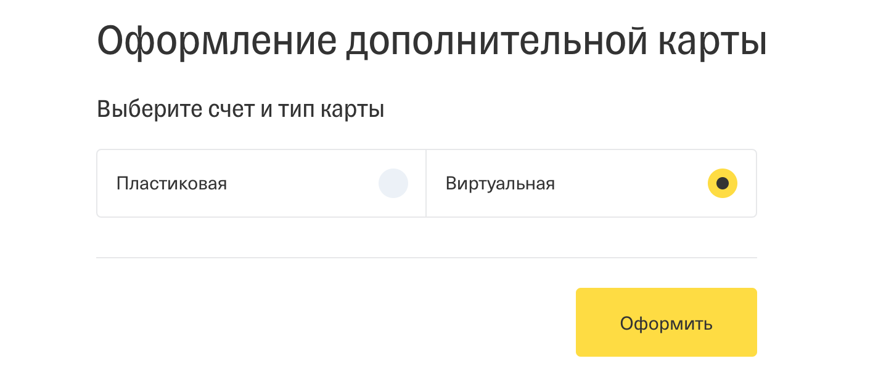

# Домашнее задание к занятию «HTTP: разработка сервера»

В качестве результата пришлите ссылки на ваши GitHub-проекты в личном кабинете студента на сайте [netology.ru](https://netology.ru).

Все задачи этого занятия нужно делать в **одном репозитории**.

**Важно**: если у вас что-то не получилось, то оформляйте Issue [по установленным правилам](../report-requirements.md).

**ВАЖНО**: НИ В КОЕМ СЛУЧАЕ НЕ ПОДСТАВЛЯЙТЕ ДАННЫЕ СВОИХ РЕАЛЬНЫХ КАРТ В КОД! Это очень частая "оплошность", когда разработчики случайно коммитят и заливают на GitHub "чувствительные" (sensitive) данные (ключи, логины, пароли, адреса и т.д.). Используйте генераторы вроде: https://www.freeformatter.com/credit-card-number-generator-validator.html

Если вы всё же "случайно" залили чувствительные данные на GitHub, то используйте [инструкцию по удалению данных](https://help.github.com/en/github/authenticating-to-github/removing-sensitive-data-from-a-repository). Кроме того, как бы это печально не было, рекомендуем вам заблокировать карту и заказать в банке новую.

## Как сдавать задачи

1. Создайте на вашем компьютере Go-модуль (см. доп.видео к первой лекции)
1. Инициализируйте в нём пустой Git-репозиторий
1. Добавьте в него готовый файл [.gitignore](../.gitignore)
1. Добавьте в этот же каталог остальные необходимые файлы (убедитесь, что они аккуратно разложены по пакетам)
1. Удостоверьтесь, что вы правильно отформатировали файлы (см. раздел Форматирование из [первого ДЗ](../01_std))
1. Сделайте необходимые коммиты
1. Создайте публичный репозиторий на GitHub и свяжите свой локальный репозиторий с удалённым
1. Сделайте пуш (удостоверьтесь, что ваш код появился на GitHub)
1. Ссылку на ваш проект отправьте в личном кабинете на сайте [netology.ru](https://netology.ru)
1. Задачи, отмеченные, как необязательные, можно не сдавать, это не повлияет на получение зачета (в этом ДЗ все задачи являются обязательными)

## Задача №1 - Заказ Карты

Мы хотим дать возможность пользователю заказывать дополнительные карты (на лекции мы с вами рассмотрели вопрос вывода списка карт).

Для этого вам необходимо разработать API, который позволяет реализовывать следующий сценарий (см. детали ниже).

Шаг 1. Выбор услуги по заказу карты (можно выбрать как дополнительную, так и виртуальную):

Примечание: скриншот Интернет Банка Тинькофф

Шаг 2. Заказ карты:

### Детали реализации

На самом деле, вам не важно, как оно нарисовано во фронтенде.

Вы говорите, я предоставляю API (как мы делали со списком получения карт) с таким-то методом.

В это API должно быть передано:
1. Параметр тип карты (предложите сами в виде чего и какие допустимые значения)
1. Issuer (несмотря на то, что во фронтенде такого выбора нет, фронтенд может вам присылать этот скрытый от пользователя параметр, например, Visa или MasterCard)
1. Id пользователя*

Примечание*: поскольку мы не занимались ещё вопросами безопасности, будем считать, что присланный Id не подделан, проверяет другая подсистема нашего приложения.

Соответственно, вам нужно:
1. Разработать такой метод в API и удостовериться, что при отправке этих данных карта создаётся и добавляется в список карт
1. Переделать метод получения списка карт, потребовав в него передавать Id пользователя, чтобы показывать ему только его карты
1. Разработать запросы, демонстрирующие успешные и неуспешные сценарии и положить их в файлик `requests.http`

Обратите внимание: вам нужно подумать, как организовать хранение виртуальных карт.

Ещё сделаем такую ремарку: заказать дополнительную карту или виртуальную может только пользователь, у которого уже есть карта. Если не совсем понятно зачем это нужно, то вот вам наводка: Card Holder.

Подсказки по реализации

По поводу хранения: вы можете всё это хранить либо в отдельных слайсах (обычные карты и виртуальные), либо в структуру карты добавлять соответствующий признак.

По поводу Id: задаёте счётчик и у каждой добавляемой карты Id будет на 1 больше.

По поводу номера карты: генерируйте сами в формате "000x", где X - Id карты (тут не идёт речи о безопасности и валидности генерируемого номера), нам это нужно только для работоспособности.

Card Holder: вот тут уже интересно. Откуда же брать Card Holder? Ответ будет вот таким: заказать дополнительную или виртуальную карту может только существующий пользователь, а значит, мы можем поискать по существующим картам и найти там Card Holder по Id владельца. Либо выдать ошибку. 

**Важно**: не забудьте попробовать предусмотреть ошибки и на ошибки генерировать специальный ответ. Это значит, что сервис должен возвращать не только данные, но и ошибку. А Handler уже на базе этого решит, отдавать JSON с данными или с ошибкой.

Итого, у вас должно быть: оформленный проект с пакетами, выложенный в репозиторий на GitHub (автотесты делать не нужно).

## Задача №2 - Heroku

Вам нужно по [пошаговой инструкции](heroku.md) опубликовать разработанный вами сервис на Heroku.

Итого, у вас должно быть: оформленный проект с пакетами, выложенный в репозиторий на GitHub (автотесты делать не нужно) и в README.md вашего проекта указан URL на Heroku, на котором работает ваш сервис.
