# Развёртывание приложения на Heroku

Запускать сервер на локальном компьютере, конечно, интересно. Но лучше запускать его на сервере.

С этой целью мы будем использовать бесплатный облачный сервис Heroku.

Мы взяли приложение с лекции и на базе него проделали все шаги, описанные в данном руководстве.

Исходники приложения, которое описывается в этом руководстве, лежат по адресу https://github.com/netology-code/bgo-heroku

## Процесс развёртывание

### Шаг 1. Изменение имён переменных окружения

Необходимо поменять имена переменных окружения на `PORT` и `HOST` соответственно (т.к. облачный сервис Heroku в переменную окружения `PORT` записывает тот порт, на котором должно запускаться ваше приложение).

```go
func main() {
	port, ok := os.LookupEnv("PORT")
	if !ok {
		port = defaultPort
	}

	host, ok := os.LookupEnv("HOST")
	if !ok {
		host = defaultHost
	}

	log.Println(host)
	log.Println(port)

	if err := execute(net.JoinHostPort(host, port)); err != nil {
		log.Println(err)
		os.Exit(1)
	}
}
```

Мы добавили немного логгирования, чтобы нам было проще помогать вам с ошибками.

### Шаг 2. GitHub Actions

Конфигурационный файл GitHub Actions такой же, как и был на прошлых лекциях:

```yaml
name: Go

on:
  push:
    branches: [ master ]
  pull_request:
    branches: [ master ]

jobs:

  build:
    name: Build
    runs-on: ubuntu-latest
    steps:

      - name: Set up Go 1.x
        uses: actions/setup-go@v2
        with:
          go-version: 1.14
        id: go

      - name: Check out code into the Go module directory
        uses: actions/checkout@v2

      - name: Get dependencies
        run: go get -v -t -d ./...

      - name: Build
        run: go build -v ./...

      - name: Test
        run: go test -v ./...
```

### Шаг 3. go.mod

В файл go.mod последней строкой нужно добавить следующее:

```
// +heroku goVersion go1.14
```

Это позволит нам указать Heroku, что нужно использовать go1.14, а не другую версию.

### Шаг 4. Procfile

Также необходимо создать прямо в корне вашего проекта (там же, где go.mod) файл с названием Procfile (именно в таком виде, первая P большая, остальные маленькие, файл без расширения), со следующим содержимым:

```
web: bin/bank
```

Это указание Heroku, какой файл нужно запускать. Heroku сам скомпилирует всё, что у вас есть в `cmd` и если там был пакет `bank`, то он создаст такой исполняемый файл и поместит его в `bin/bank`.

### Шаг 5. Регистрация на Heroku

Перед регистрацией на Heroku не забудьте создать репо на GitHub и запушить туда всё, что мы сделали.

#### 5.1. Переходите по адресу https://heroku.com и нажимаете на кнопку SignUp:


#### 5.2. Заполняете форму, говорите, что вы Student, из Российской Федерации и ваш основной язык Go:

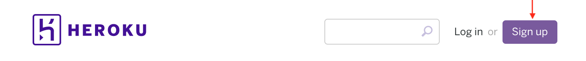

#### 5.3. После подтверждения email и всех формальностей, логинитесь (кнопка Login):


#### 5.4. Перейдите на Dashboard:


#### 5.5. Выберите создание нового приложения:

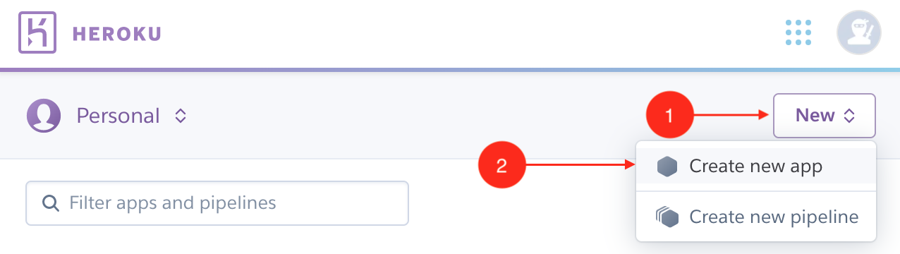

#### 5.6. Выберите имя:

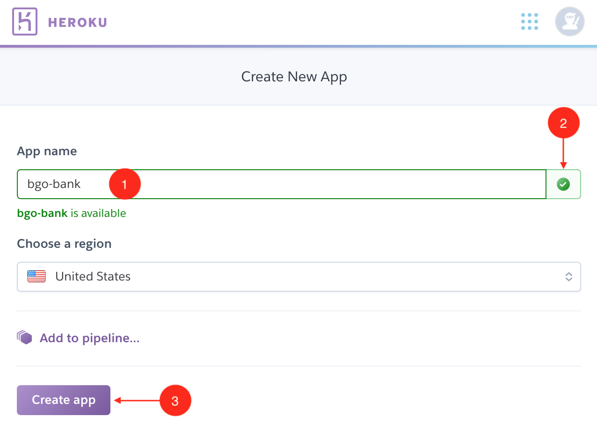

Важно: вам нужно придумать уникальное имя (1) и удостовериться, что оно не занято (2). Имя bgo-bank мы уже заняли, поэтому использовать его у вас не получится.

Вводите что-нибудь наподобие <github-login>-bank (где <github-login> - это ваш логин на GitHub). Тогда вероятность того, что это имя не занято, будет выше.

После выбора уникального имени нажимайте на Create App (3).

#### 5.7. Deploy:

На следующей странице найдите секцию Deploy, выберите GitHub (1) и нажмите Connect (2):

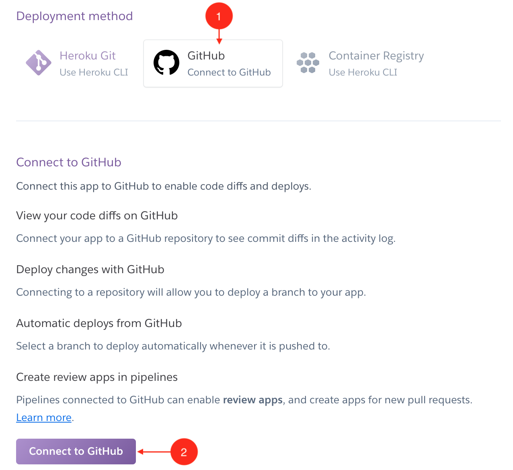

### 5.8. Access:

Откроется новое окошко, в котором Heroku попросит доступ к вашим репозиториям на GitHub (чтобы получать уведомления о том, что вы сделали Push и т.д.):

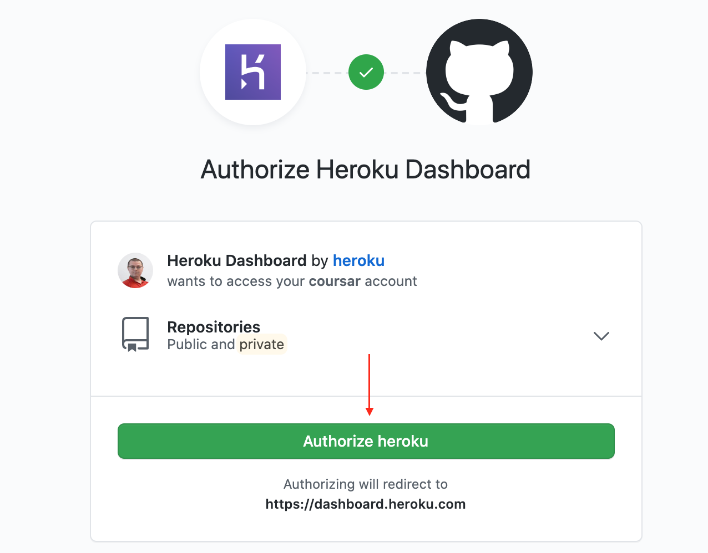

Это позволит при каждом новом Push'е в репозиторий автоматически разворачивать новую версию приложения на сервере.

### 5.8. Search:

После того, как вы дали доступ Heroku, введите имя репозитория на GitHub (1) и нажмите Search (2):

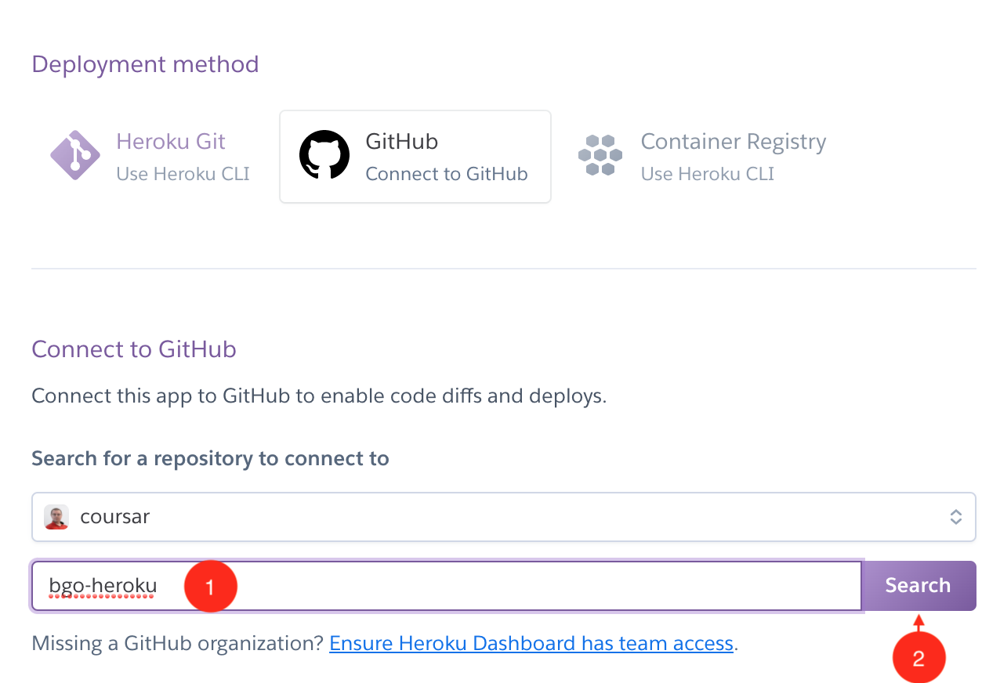

Обратите внимание: название репо не обязательно должно соответствовать названию приложения на Heroku!

В нашем примере репо - bgo-heroku, название приложения - bgo-bank.

### 5.8. Connect:

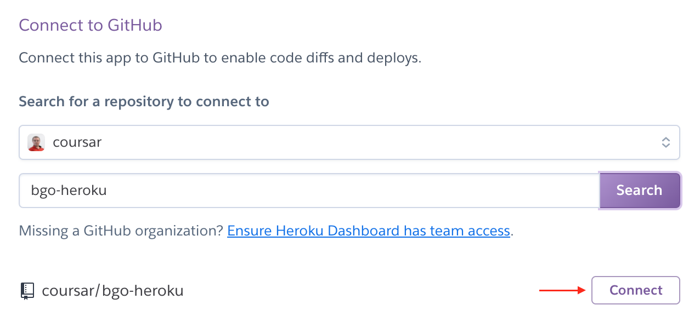

Если всё прошло успешно, вы увидите:

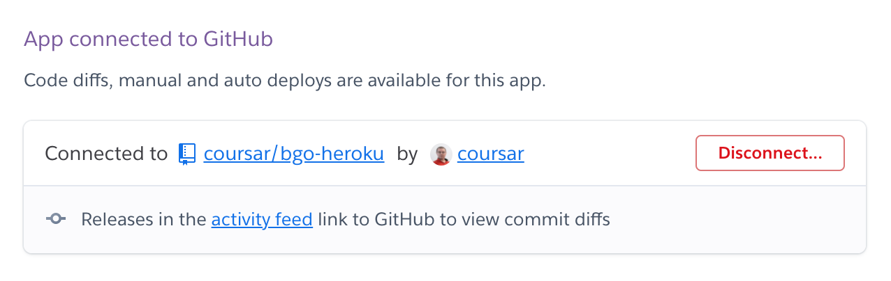

### 5.9. Automatic Deploys

На той же странице найдите раздел Automatic Deploys, выставьте флажок (1) и нажмите кнопку Enable (2): 

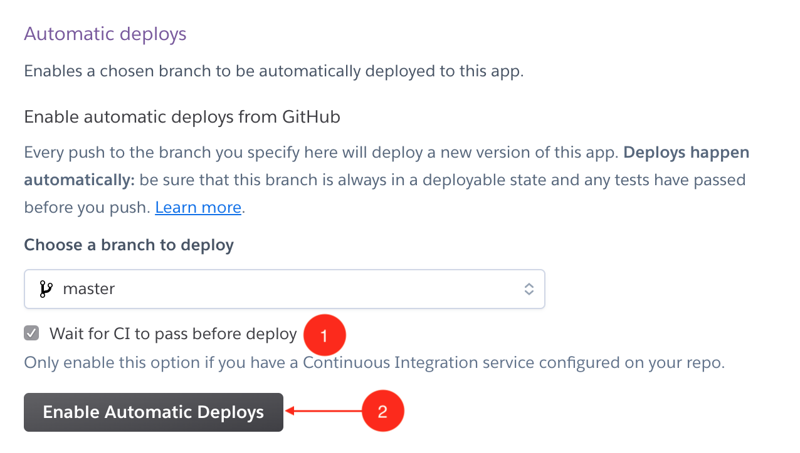

### 5.10. Manual Deploys

Чтобы инициировать развёртывание, вы можете либо сделать Push в GitHub репозиторий, либо ниже в секции Manual Deploy нажать на кнопку Deploy: 


Если с вашим приложением всё в порядке, то вы увидите кнопку View, на которой нужно кликнуть:

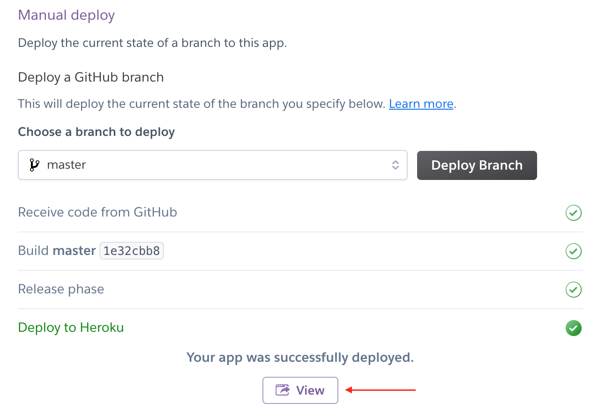

### 5.11. 404

При переходе по ссылке вы увидите вот такую страницу:


В этом нет ничего страшного, просто мы перешли на адрес, для которого у нас нет обработчика, поэтому сервер выдал ошибку, а Heroku её обработал.

Перейдём по адресу /getCards:


### 5.12. README.md

Осталось последняя часть: в вашем GitHub репо нужно создать прямо в корне файл README.md и туда просто скопировать ссылку на ваше приложение на Heroku.

## Если не получилось

Если у вас что-то не получилось, то заходите на Heroku в раздел Collaborators (1) и добавляете в коллабораторы (2) тот email, что указан на скриншоте:

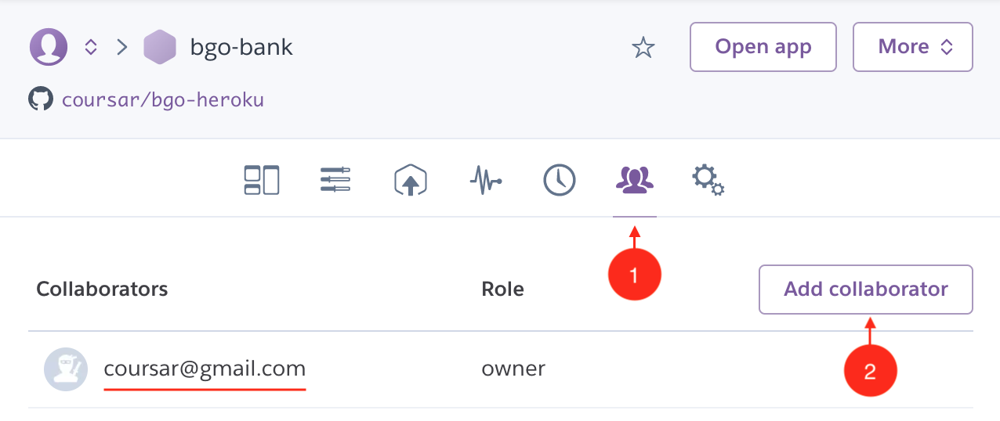

В GitHub проделываете то же самое.

Затем тегаете @coursar в общем канале курса в Slack. Если в течение рабочего дня не отвечает - тегаете координатора.