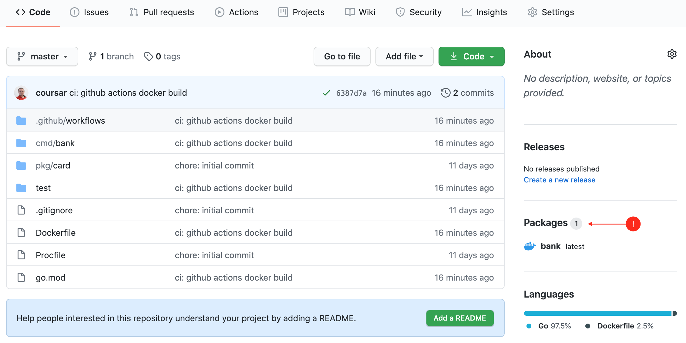
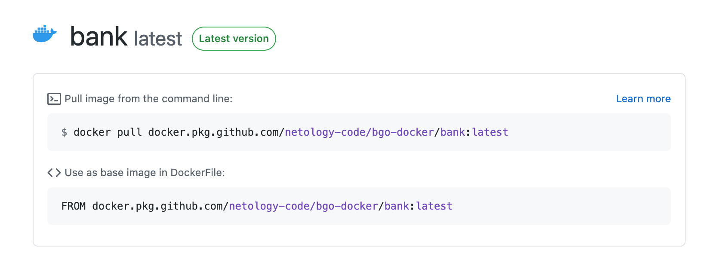
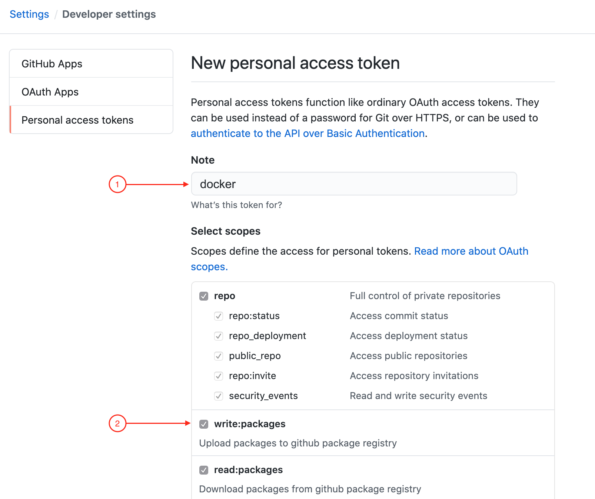

# GitHub Packages Docker Registry

Здесь всё делится на два этапа:
1. Публикация
1. Использование

**Важно**: если вы всё-таки решили сделать эту задачу на Play With Docker, не забудьте после завершения работы сделать `docker logout` и удалить Token (с помощью панели управления GitHub).

## Публикация

Публикация не представляет из себя ничего сложного: вы просто дорабатываете ваш файл, который должен выглядеть теперь следующим образом:

```yaml
name: Go

on:
  push:
    branches: [ master ]
  pull_request:
    branches: [ master ]

jobs:

  build:
    name: Build
    runs-on: ubuntu-latest
    steps:

      - name: Set up Go 1.x
        uses: actions/setup-go@v2
        with:
          go-version: 1.14
        id: go

      - name: Check out code into the Go module directory
        uses: actions/checkout@v2

      - name: Get dependencies
        run: go get -v -t -d ./...

      - name: Build
        run: go build -v ./...

      - name: Test
        run: go test -v ./...

      # добавили всё, что ниже

      - name: Build binary for docker image
        run: go build -v -o bank ./cmd/bank
        env:
          CGO_ENABLED: 0

      - name: List
        run: ls -la

      - name: Push to GitHub Packages
        uses: docker/build-push-action@v1
        with:
          username: ${{ github.actor }}
          password: ${{ secrets.GITHUB_TOKEN }}
          registry: docker.pkg.github.com
          repository: netology-code/bgo-docker/bank
          tag_with_ref: true
```

Давайте разбираться:
* Build binary for docker image - `go build -v ./...` собирает всё и отбрасывает результат, поэтому мы ввели отдельный блок, который собирает конкретный исполняемый файл для использования в сборке Docker образа
* List - это нужно нам для отладки, так нам проще будет помочь вам, если что-то пойдёт не так - просто выводим список файлов в каталоге
* Push to GitHub Packages - это специальный [`action`](https://github.com/marketplace/actions/build-and-push-docker-images), который находит ваш `Dockerfile`, собирает его и публикует в вашем репо

**Обратите внимание**: вам нужно заменить `netology-code/bgo-docker/bank` на `<ваш аккаунт в github>/<ваш репо в github>/<имя для образа>`.

Удостоверьтесь, что сборка проходит, после этого (обычно через минут 5), вы увидите в боковой панели своего репозитория информацию об опубликованных пакетах:





Если интересно, то полную документацию вы можете посмотреть [вот здесь](https://docs.github.com/en/actions/language-and-framework-guides/publishing-docker-images)

Теперь самое интересное - как скачать этот образ локально?


## Использование

Для локального использования вам понадобится GitHub Token.

Перейдите в настройки:


Выберите пункт меню Developer Settings:


Выберите пункт меню Personal Access Tokens (1), затем нажмите на кнопку Generate new token (2):


Заполните поле Note (1) и поставьте флажок напротив write:packages (2), остальные все флажки выставятся автоматически:



После чего нажмите на кнопку Generate в самом низу страницы:


GitHub запроси у вас пароль для подтверждения:


После чего вам будет сгенерирован токен. **Важно**: токен будет показан только один раз, поэтому убедитесь, что скопировали его:


Если вдруг вы всё-таки не скопировали его, то просто удалите старый и сгенерируйте новый.

Теперь в командной строке выполните следующее:

```shell script
docker login https://docker.pkg.github.com
```

Вас спросят ваш логин (логин GitHub) и пароль (сгенерированный токен):
```
docker login https://docker.pkg.github.com
Username: coursar
Password: 
WARNING! Your password will be stored unencrypted in /home/user/.docker/config.json.
Configure a credential helper to remove this warning. See
https://docs.docker.com/engine/reference/commandline/login/#credentials-store

Login Succeeded
```

Обратите внимание, пароль при вводе не отображается (т.е. вы ничего не увидите, поэтому просто копируйте и вставляйте).

После чего уже можете выполнять указанные команды:

```shell script
docker pull docker.pkg.github.com/netology-code/bgo-docker/bank:latest
docker container run -p 9999:9999 docker.pkg.github.com/netology-code/bgo-docker/bank
```

Когда вы будете работать в организации, вы как раз будете использовать приватные репозитории для своих образов.

