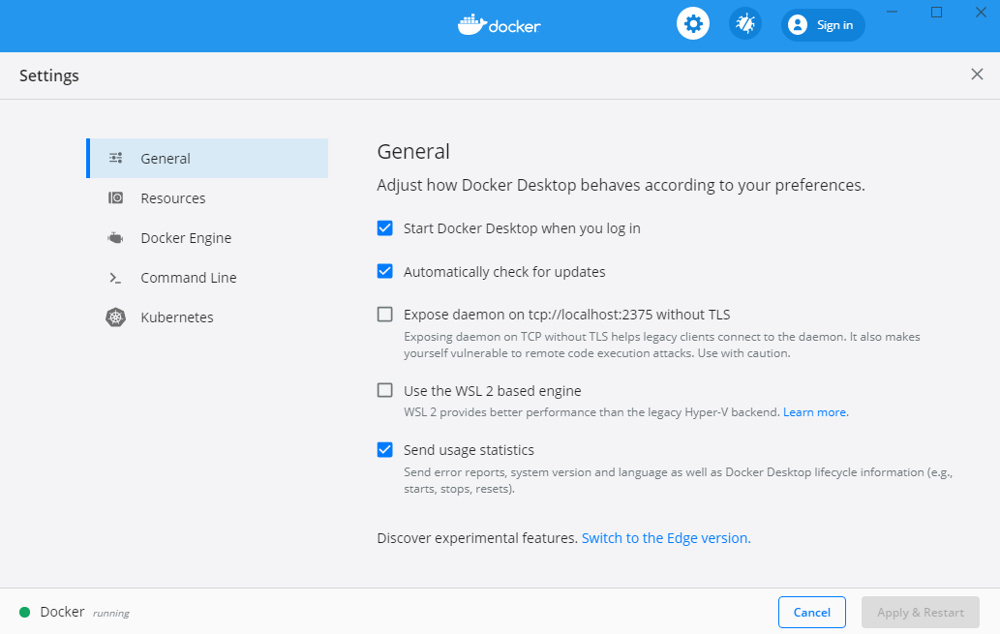
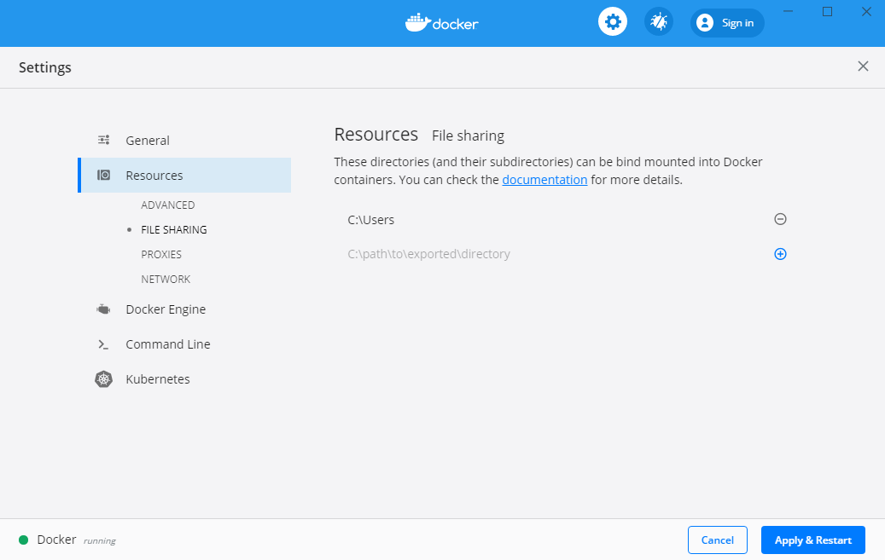

# Инструкция по работе с Volumes для Docker и Docker Toolbox

## Volumes

Volumes - механизм, позволяющий "пробрасывать" каталоги в контейнер. Т.е. буквально вы можете подключить каталог с вашего компьютера к каталогу в контейнере.


Изображение с сайта https://docs.docker.com.

Прежде чем разбираться, как это делать, вам нужно понять, что и зачем вам вообще подключать в volumes. 

## Инициализация контейнеров

Многие образа на своих страницах предлагают использовать специальный каталог для начальной инициализации (т.е. если туда положить файлы нужного формата, то база данных при старте их будет считывать и выполнять).

Postgres:


Для других СУБД то же самое.

MySQL:


Mongo:


Обратите внимание, что файлы, найденные в этом каталоге, исполняются в алфавитном порядке. Поэтому, если хотите обеспечить порядок выполнения, называйте файлы 01_xxx.sql, 02_xxx.sql и т.д.

Если вы всё сделаете правильно, то при запуске контейнера в логах контейнера увидите (о том, как запускать - читайте ниже):

```
postgresdb_1_XXXXXXXX | /usr/local/bin/docker-entrypoint.sh: running /docker-entrypoint-initdb.d/schema.sql
postgresdb_1_XXXXXXXX | CREATE TABLE
postgresdb_1_XXXXXXXX | CREATE TABLE
```

## Docker (Linux)

Здесь всё достаточно просто:
1. Создаёте в каталоге проекта каталог `docker-entrypoint-initdb.d`
1. Помещаете файлы `data.sql` и `schema.sql` в каталог `docker-entrypoint-initdb.d`
1. Запускаете Docker Container командой `docker container run -p 5432:5432 -v /home/admin/projects/sql/docker-entrypoint-initdb.d:/docker-entrypoint-initdb.d:ro -e POSTGRES_PASSWORD=pass -e POSTGRES_USER=app -e POSTGRES_DB=db postgres:12.3-apline`

Где:
1. `/home/admin/projects/sql/docker-entrypoint-initdb.d` - абсолютный путь до каталога `docker-entrypoint-initdb.d` в вашем проекте*.
1. `ro` - каталог доступен только для чтения

Примечание*: можно сократить запись, используя возможности shell, но мы в целях упрощения этого делать не стали.

## Docker Desktop (Windows)

Здесь тоже всё не сложно (если вы используете WSL2, если не используйте - читайте ниже):
1. Создаёте в каталоге проекта каталог `docker-entrypoint-initdb.d`
1. Помещаете файлы `data.sql` и `schema.sql` в каталог `docker-entrypoint-initdb.d`
1. Запускаете Docker Container командой `docker container run -p 5432:5432 -v c:/Users/admin/projects/sql/docker-entrypoint-initdb.d:/docker-entrypoint-initdb.d:ro -e POSTGRES_PASSWORD=pass -e POSTGRES_USER=app -e POSTGRES_DB=db postgres:12.3-apline`

Где:
1. `c:/Users/admin/projects/sql/docker-entrypoint-initdb.d` - абсолютный путь до каталога `docker-entrypoint-initdb.d` в вашем проекте*.
1. `ro` - каталог доступен только для чтения

### WSL 2

Если ваша установка Docker не использует WSL 2 (Windows Subsystem for Linux), то в настройках Docker нужно включить File Sharing.

Как определить, использует или нет: заходите в настройки Docker:



Если флажок напротив `Use the WSL 2 based Engine` не выставлен, то значит не используете.

Переходите на вкладку `Resources` -> `File Sharing` и через кнопку + добавляете `C:\Users`, чтобы всё выглядело, как на экране



После чего нажимаете `Apply & Restart`.

Далее работаете по той же схеме, что и с Docker с WSL2.

## Docker Toolbox (Windows)

Если вы счастливый обладатель Docker Toolbox на Windows, то вам придётся немного понастраивать систему.

Что нужно сделать:

1. Откройте VirtualBox:


2. Выберите машину `default` и нажмите на кнопку настроить:


3. Выберите опцию `Общие папки` и убедитесь, что настройки там такие же, как на скриншоте (если нет, то кликните два раза и поправьте):


4. Если вы поменяли на предыдущем шаге настройки, то после этого щёлкните на машине `default` правой кнопкой мыши и выберите `Перезапустить`:


Важно: Docker будет подключать только каталоги из `C:\Users`, поэтому мы рекомендуем вам в папке вашего пользователся создать каталог `projects` и работать там.

Открываете ваш проект в GoLand и вводите в консоли (`Alt + F12`):

```
docker container run -p 5432:5432 -v /c/Users/admin/projects/sql/docker-entrypoint-initdb.d:/docker-entrypoint-initdb.d:ro -e POSTGRES_PASSWORD=pass -e POSTGRES_USER=app -e POSTGRES_DB=db postgres:12.3-alpine
```

Обратите внимание, что `Users` было написано с большой буквы и путь именно `/c/`, а не `C:\`.

## Docker Compose

В всех случаях нам приходилось вводить абсолютный путь до каталога с sql-файлами. С Docker Compose всё будет гораздо проще (для Docker Toolbox важно, чтобы ваш проект находился в одном из подкаталогов `C:\Users`, а для Docker Desktop для Windows без WSL2 в одном из каталогов из списка про File Sharing):

```
version: '3.8'
services:
  db:
    image: postgres:12.3-alpine
    ports:
      - 5432:5432
    volumes:
      - ./docker-entrypoint-initdb.d:/docker-entrypoint-initdb.d:ro
```

Как вы видите, 

Таким образом, вам достаточно:
1. Создать в каталоге проекта файл `docker-compose.yml` с указанным содержимым
1. Создать в каталоге проекта каталог `docker-entrypoint-initdb.d`
1. Поместить файлы `data.sql` и `schema.sql` в каталог `docker-entrypoint-initdb.d`

И в консоли запускаете `docker-compose up`.

**Обратите внимание**: контейнер не удаляется, пока вы его сами не удалите (например, через `docker-compose rm`), а значит база данных и все изменения файловой системы внутри контейнера будут те же (что выполнились при создании контейнера).

О чём речь? Вы сделали в первый раз `docker-compose up` - создался и запустился новый контейнер. Теперь, если вы сделаете `docker-compose stop` (или остановите через `Ctrl + C`) и затем снова `docker-compose up` - то создастся не новый контейнер, а запустится старый (который был остановлен). При этом никакие скрипты из `/docker-entrypoint-initdb.d` выполняться не будут. В качестве самого простого решения просто удаляйте контейнеры через `docker-compose rm` после их остановки. 

