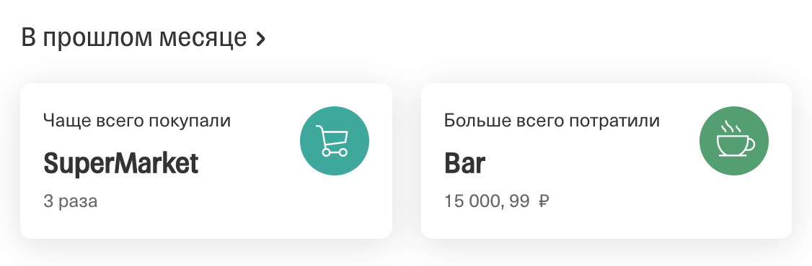

# Домашнее задание к занятию «4.3. Реляционные базы данных - использование из Go»

В качестве результата пришлите ссылки на ваши GitHub-проекты в личном кабинете студента на сайте [netology.ru](https://netology.ru).

Все задачи этого занятия нужно делать в **одном репозитории**.

**Важно**: если у вас что-то не получилось, то оформляйте Issue [по установленным правилам](../report-requirements.md).

**ВАЖНО**: НИ В КОЕМ СЛУЧАЕ НЕ ПОДСТАВЛЯЙТЕ ДАННЫЕ СВОИХ РЕАЛЬНЫХ КАРТ В КОД! Это очень частая "оплошность", когда разработчики случайно коммитят и заливают на GitHub "чувствительные" (sensitive) данные (ключи, логины, пароли, адреса и т.д.). Используйте генераторы вроде: https://www.freeformatter.com/credit-card-number-generator-validator.html

Если вы всё же "случайно" залили чувствительные данные на GitHub, то используйте [инструкцию по удалению данных](https://help.github.com/en/github/authenticating-to-github/removing-sensitive-data-from-a-repository). Кроме того, как бы это печально не было, рекомендуем вам заблокировать карту и заказать в банке новую.

## Как сдавать задачи

1. Ознакомьтесь с [дополнительным материалом про объединение таблиц](joins.md)
1. Создайте на вашем компьютере Go-модуль (см. доп.видео к первой лекции)
1. Инициализируйте в нём пустой Git-репозиторий
1. Добавьте в него готовый файл [.gitignore](../.gitignore)
1. Добавьте в этот же каталог остальные необходимые файлы (убедитесь, что они аккуратно разложены по пакетам)
1. Удостоверьтесь, что вы правильно отформатировали файлы (см. раздел Форматирование из [первого ДЗ](../01_std))
1. Сделайте необходимые коммиты
1. Создайте публичный репозиторий на GitHub и свяжите свой локальный репозиторий с удалённым
1. Сделайте пуш (удостоверьтесь, что ваш код появился на GitHub)
1. Ссылку на ваш проект отправьте в личном кабинете на сайте [netology.ru](https://netology.ru)
1. Задачи, отмеченные, как необязательные, можно не сдавать, это не повлияет на получение зачета (в этом ДЗ все задачи являются обязательными)

## Задача №1 - Сервис

Вы уже умеете делать веб-сервисы, предоставляющие API, подобное Vk.

Соответственно, вам нужно переделать работу с данными, хранящимися в памяти, на работу с данными, хранящимися в СУБД. Т.е. теперь ваш сервис хранит не слайс с данными, а `pgx.Pool`, с помощью которого и "ходит" в БД.

Обратите внимание, что `pgx.Pool` можно безопасно использовать из конкурентных горутин, поэтому защищать его мьютексом не нужно.

### Что нужно сделать

Нужно сделать API, состоящее из двух методов:
1. `getCards` - возвращает список карт конкретного клиента по id
1. `getTransactions` - возвращает список транзакций по конкретной карте (т.е. `id` карты нужно передавать в запросе*)

Примечание*: как мы уже говорили, вопросы безопасности мы будем рассматривать в следующем курсе.

Используйте схему и данные из предыдущей ДЗ.

Ловушка 👿

Всегда, когда работаете с таблицами, в которых потенциально может быть больше нескольких десятков объектов, ставьте лимит (например, не более 50).

Почему? Потому что срок годности вашей карты может быть 5 лет и без лимита (или условия по дате), вы будете вытаскивать при каждом запросе все транзакции за 5 лет (а это время и нагрузка на БД).

Формат отдаваемого JSON определите сами.

Итого, у вас должен быть веб-сервис, с указанными выше API (не забудьте приложить `requests.http`, в котором описано, как вызывать ваше API, и `docker-compose.yml`, с помощью которого можно стартовать контейнер для вашего сервиса). 

Обратите внимание: контейнер с БД автоматически должен инициализировать базу с демо-данными (см. `docker-entrypoint-initdb.d`)

## Задача №2 - Analytics

Добавьте в API вашего веб-сервиса метод (или методы) для показа следующих данных:

Вы можете сделать это как в виде одного метода, так и двух.

Итого, у вас должен быть веб-сервис, с указанными выше API (не забудьте приложить `requests.http`, в котором описано, как вызывать ваше API, и `docker-compose.yml`, с помощью которого можно стартовать контейнер для вашего сервиса). 

Обратите внимание: контейнер с БД автоматически должен инициализировать базу с демо-данными (см. `docker-entrypoint-initdb.d`)

Итого, у вас должен быть веб-сервис, с указанными выше API (не забудьте приложить `requests.http`, в котором описано, как вызывать ваше API, и `docker-compose.yml`, с помощью которого можно стартовать контейнер для вашего сервиса). 
