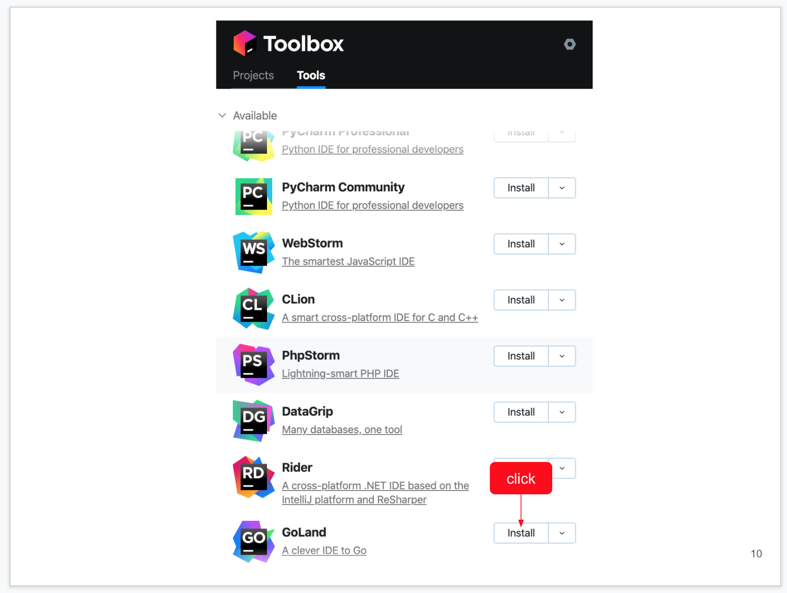
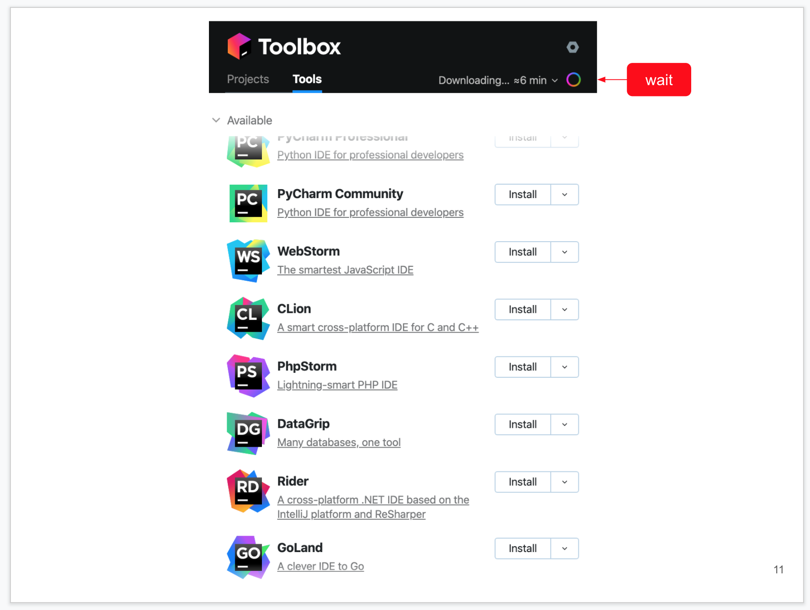
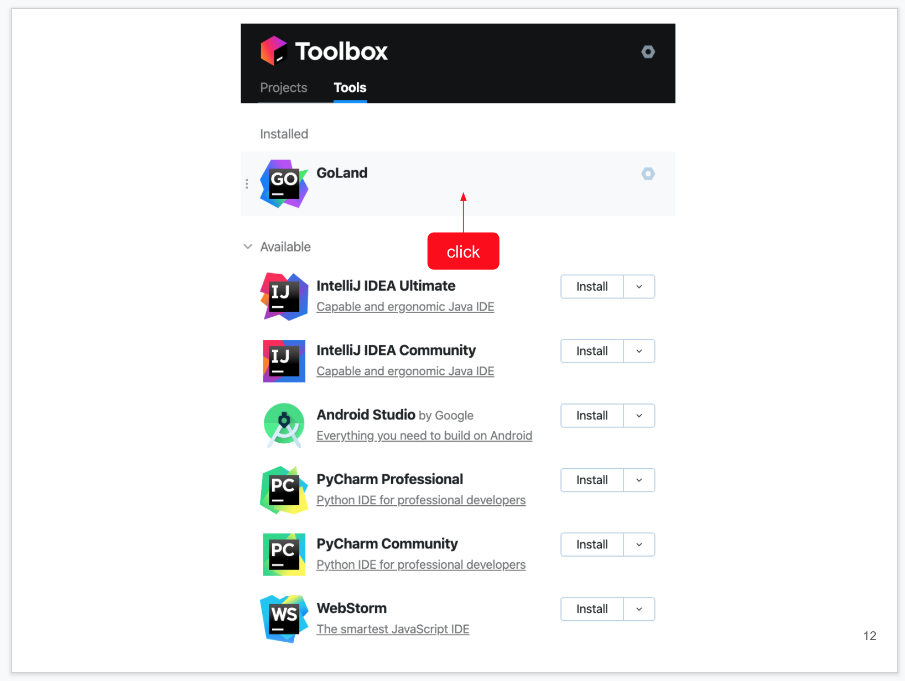
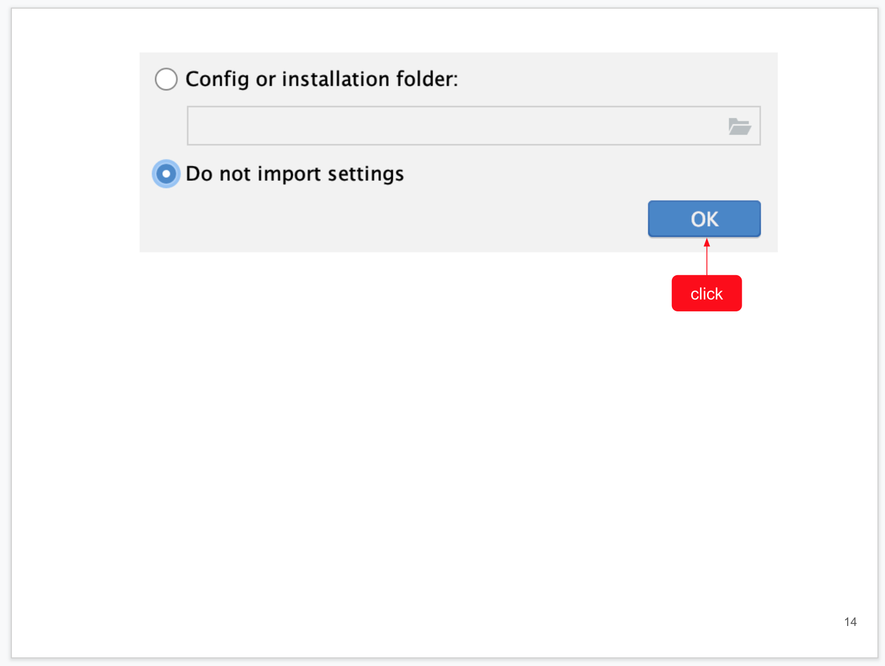
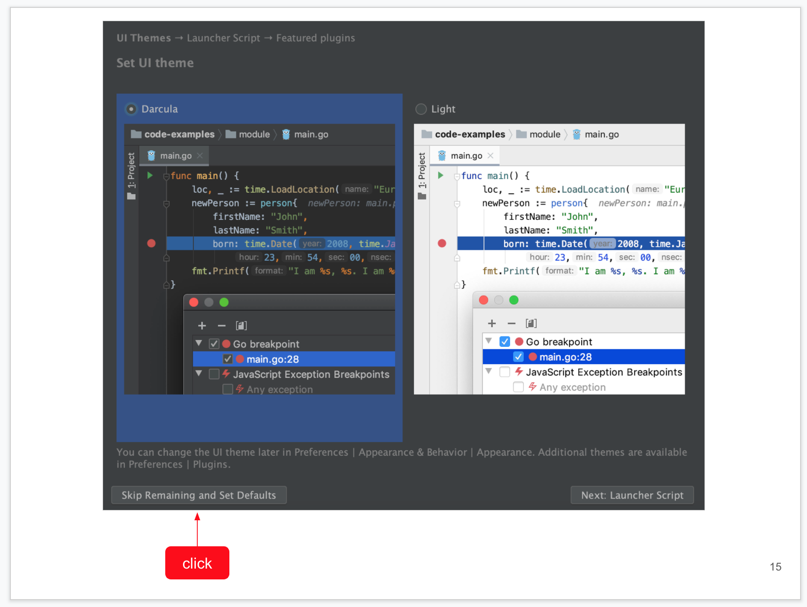
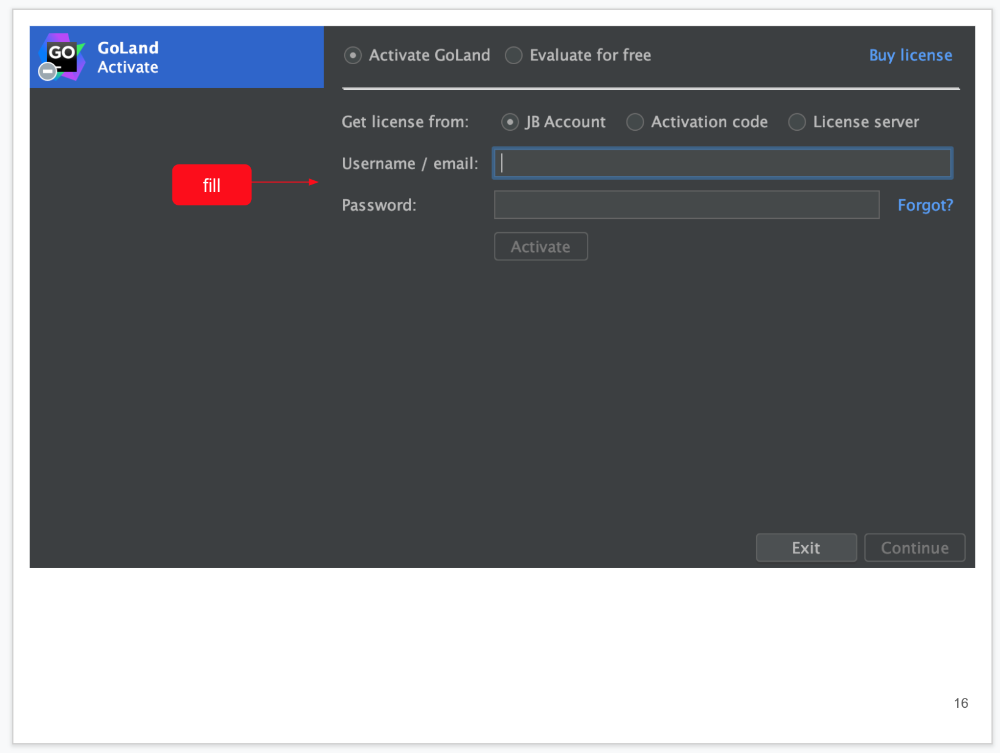

# Установка и активация GoLand

В курсе будет использоваться коммерческая IDE от компании JetBrains. Как студенту курса вам предоставляется купон на бесплатное использование на 6 месяцев.

**Важно**: всё абсолютно бесплатно. Не вводите нигде никаких данных карт, не скачивайте никаких активаторов и т.д.

##### Шаг 0. Вам необходимо обратиться к координатору, чтобы получить номер купона.

##### Шаг 1. Переходите на страницу https://www.jetbrains.com/store/redeem/ и заполняете форму:

Соответственно:

1 - ваши персональные данные и купон (вводите действующий email, он нужен будет для активации)

2 - продукт (если вы используете это руководство для установки другого продукта, например IDEA или WebStorm, то выбираете его). Для курсов Go нужен GoLand

3 - отправляете форму

###### Шаг 2. При успешном заполнении формы получаете страничку:

###### Шаг 3. Переходите в свой почтовый ящик, указанный на первом шаге и ищете там письмо от JetBrains:

Переходите по ссылке из письма

###### Шаг 4. Внимательно читаете и принимаете лицензионное соглашение

###### Шаг 5. Создаёте JetBrains аккаунт

Все поля, кроме логина и паролей будут предзаполнены. Вам остаётся только выбрать логин, установить пароль и поставить флажки

Нажимаете на кнопку "Submit"

###### Шаг 6. Подписка

Удостоверяетесь, что подписка оформлена на вас, на 6 месяцев. Если что-то пошло не так, пишете в саппорт JetBrains

###### Шаг 7. JetBrains Toolbox

JetBrains Toolbox - это удобная утилита для управления продуктами JetBrains (установка, обновление, откат к предыдущей версии)

Переходите по ссылке

###### Шаг 8. Установка JetBrains Toolbox

Выбираете вашу ОС (обычно определяется автоматически), устанавливаете и запускаете как любое другое приложение

###### Шаг 9. User Agreement

Внимательно читаете, соглашаетесь с лицензионным соглашением

###### Шаг 10. Установка GoLand

В списке продуктов находите GoLand, нажимаете на кнопку "Install"

###### Шаг 11. Ожидание установки

Ждёте, пока всё скачается и установится

###### Шаг 12. Запуск

После установки GoLand появится в блоке "Installed", запускаете его оттуда

###### Шаг 13. Data Sharing

Выбираете, отсылать статистику в JetBrains или нет

###### Шаг 14. Import Settings

Если вы до этого уже использовали продукты JetBrains и хотите импортировать настройки, можете выбрать первую опцию

Мы выбираем вторую и нажимаем "OK"

###### Шаг 15. Выбор темы

Выбираете нужную вам тему, можете выбрать другие настройки через Next

Мы же выбираем "Skip Remaining and Set Defaults"

###### Шаг 16. Активация

Оставляете всё как на скриншоте, вводите только email и пароль, которые использовали при создании JetBrains Account

###### Шаг 17. Запуск

IDE активирована, можете работать

## Q & A

1. У GoLand нет бесплатной версии
1. Если у вас что-то не получилось, присылаете номер шага и скриншот того, что не получилось
1. Купон можно активировать только один раз на один email
1. Купоны не суммируются
1. Не надо откладывать купон на "потом" (его нужно использовать до определённой даты)
1. Можно использовать учётную запись на нескольких компьютерах (например, дома и на работе)
1. Если вы выбрали и активировали купон не на тот продукт, то из личного кабинета JetBrains нужно будет писать в саппорт
